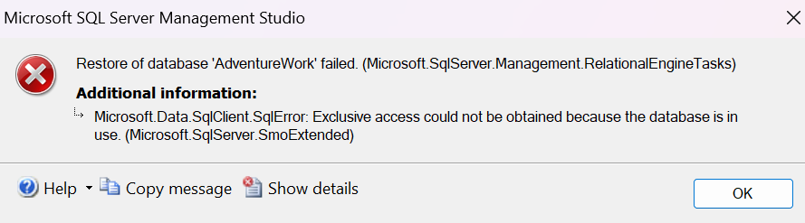
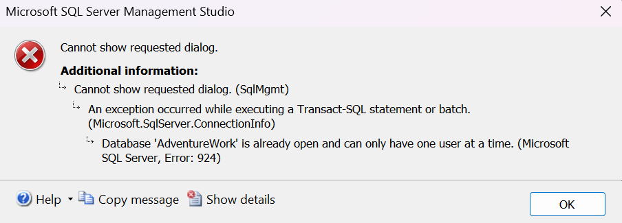

One common thing that we DBAs do before restoring any database is, probably, getting hit by the **_'Exclusive access could not be obtained because the database is in use'_** bus. 
  
  

  For which, we would end up taking the database to __single user mode__ and proceeding with the restore as planned.
  
  But at times, that can be a double edged sword and we may end up in an unintended user lockout to the database, Since only one connection is allowed. We ourselves will not be able to access the database because of some background or app process that sneaked in, and from there, things may resolve a bit easily or it may end up in a very dirty situation, wherein even a SQL service restart may not be able to help us out.
  
Checkout this blog from SQL Server Central if you want to dig deep into this single user issue:
  
[SQL Server Central: help-im-stuck-in-single-user-mode-and-cant-get-out](https://www.sqlservercentral.com/blogs/help-im-stuck-in-single-user-mode-and-cant-get-out)

We may end up with such beautiful messages in those rare cases.

  
    
## What's the better alternative ?
  An even simpler and a better alternative process to make the database available for restore, would be to simply **_take it offline_**. This will avoid all the one off edge cases and aid us in a smoother restore process.
  
  
```sql
ALTER DATABASE AdventureWorks2022 
SET OFFLINE WITH ROLLBACK IMMEDIATE;
```

  Magikkk 😉

  

  Restoring from here would be normal and the setting offline would usually be tied with the restore script execution part.
  