This post will just be a roam around and noodle around the Log record level and Page level as to what happens during a transaction rollback. Let's dive in...

### What is rollback anyway ?
- Well, Let's say you have a very good INSERT process that has been running and out of nowhere your server is in some remote site and the site loses power, due to which your server goes down..(yes.. I am exaggerating!)... or simply when a transaction gets killed midway without completing... rollback happens... to comply and enforce the ACID principles of RDBMS, to make things intact and in the way they were before the transaction happened.

We'll jump into more specifics as we go more into the experiment...

### What are we upto today ?
We'll just UPDATE some records, kill the transaction without commiting and we'll check at the log record and page level as to what are all the changes that happens during the rollback process...

We'll setup the environment... This will be a **two act** kind of thing, where, **one session will be the runner** and the **other one will be the observer**.

```sql
--Environment

-- Create sandbox
CREATE DATABASE RollbackLab;
GO
USE RollbackLab;
GO

-- Narrow rows, HEAP (Index_ID = 0)
CREATE TABLE dbo.RollPageLab (
    Id INT IDENTITY(1,1) NOT NULL,
    KeyCol INT NOT NULL,
    Val CHAR(50) NOT NULL DEFAULT 'ORIGINAL',
  --  CONSTRAINT PK_RollPageLab PRIMARY KEY NONCLUSTERED (Id)  -- Stay HEAP for this experiment
);
GO

-- Seed ~30k rows (about a few hundred pages)
;WITH N AS (
    SELECT TOP (30000) ROW_NUMBER() OVER (ORDER BY (SELECT NULL)) AS n
    FROM sys.all_objects a CROSS JOIN sys.all_objects b
)
INSERT dbo.RollPageLab (KeyCol) SELECT n FROM N;
GO

select * from dbo.RollPageLab

```
A quick look at the rows:

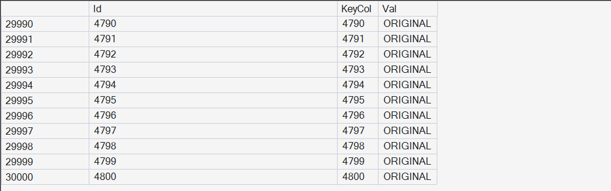

We'll use the **fn_dblog** function as usual to peek into the log records...

```sql
SELECT 
count(*) as 'LOP_INSERT_ROWS count'
FROM fn_dblog(NULL, NULL)
Where operation LIKE '%LOP_INSERT_ROWS%'

SELECT 
*
FROM fn_dblog(NULL, NULL)
Where operation LIKE '%LOP_INSERT_ROWS%'
ORDER BY [Current LSN] DESC;  

```
A quick peek into the log records...

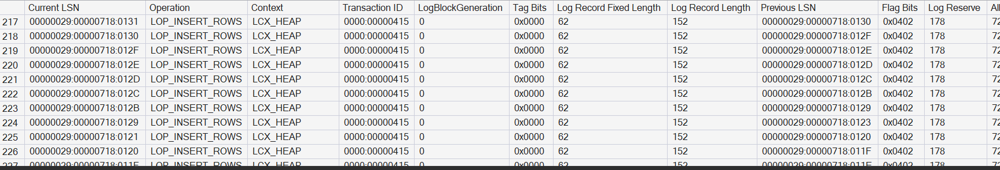

And there are approx 30,000 log records for the 30K inserts we did on the heap table.

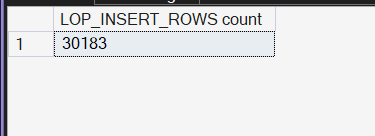

We have the integer value and the 'ORIGINAL' string decoded in hex...


Decoding the hex to give a geek feel 🤓

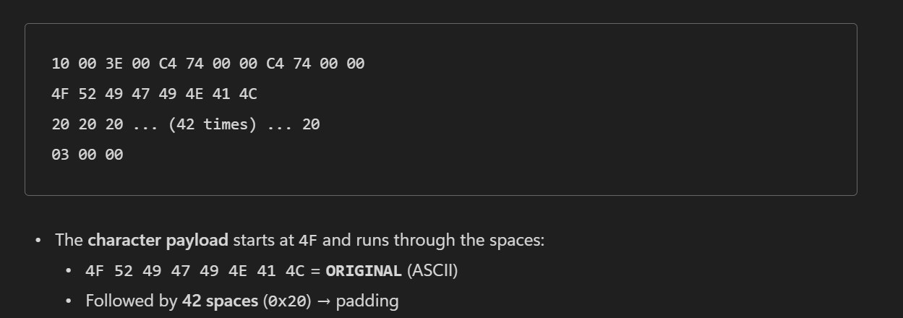

Let's head to the two act now...

For the actor...

```sql
BEGIN TRAN;

-- 1) Change the target row (so DBCC PAGE will show a clear before/after)
UPDATE dbo.RollPageLab
SET Val = 'MODIFIED_BEFORE_ROLLBACK'
WHERE Id = 22222;

-- 2) Change many rows to make rollback observable (log/undo has work)
UPDATE dbo.RollPageLab
SET Val = 'BULK-MOD'
WHERE Id BETWEEN 1 AND 20000;

-- Keep the transaction open for observation
WAITFOR DELAY '00:20:00';  -- plenty of time for you to peek "before"
-- (don't COMMIT; we'll trigger rollback from Session B)
```

Let's a take a particular ID and find which file:page:slot number it is located at and then let's take a peek into the page.

```sql
-- Get its physical location (undocumented)
SELECT 
       sys.fn_physlocformatter(%%physloc%%) AS PhysLoc
FROM dbo.RollPageLab
WHERE Id = 22222;
```


```sql
DBCC TRACEON(3604);
GO

DBCC PAGE ('RollbackLab', 1, 521, 3);  -- print page with row details (dump style = 3)
GO
```

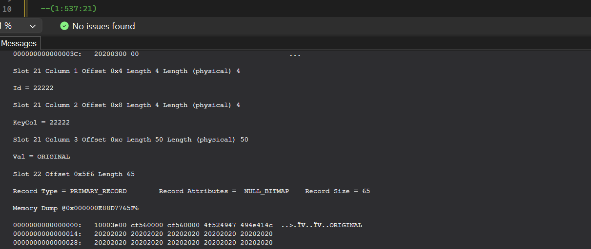

Let's run the Tran on the other tab in SSMS and we'll check some stuff in the 'observer'.

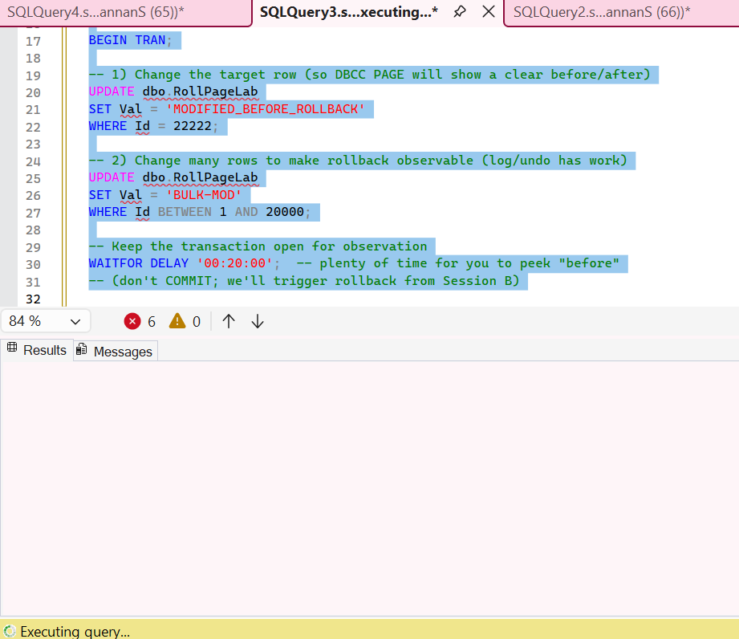

We have the transaction open for about 20 minutes, let's dig into the log to check what has happened.

Yep... As expected, the UPDATEs have generated the log records... The **LOP_MODIFY_ROW** is the entry that comes in when an update happens...
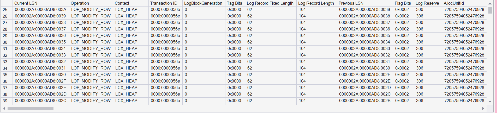


And, we have the values changing from ORIGINAL to BULK - MOD
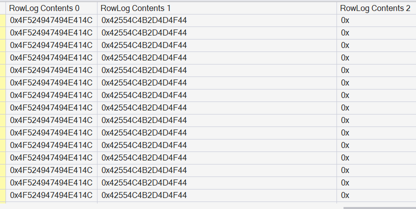

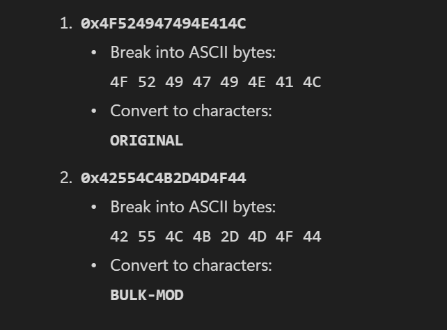

around 20k modify logs have been written for our 20k updates.
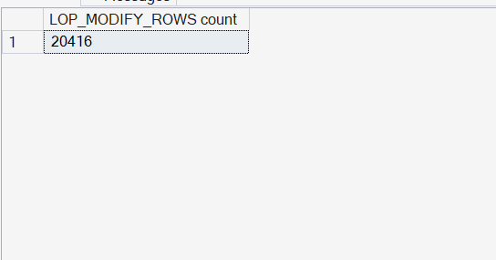

Now, let's take a look at how the page level contents have modified... We'll look at the id 22222 that we modified specifically, so that we can get a clear idea as to what has happened.

We can see the value change to **MODIFIED_BEFORE_ROLLBACK** from 'ORIGINAL' at the page level !!!. STILL, the TRANSACTION HAS NOT YET COMMITTED ! So,**WHAT WE SEE MAY OR MAY NOT BE THE TRUTH! 🫢**

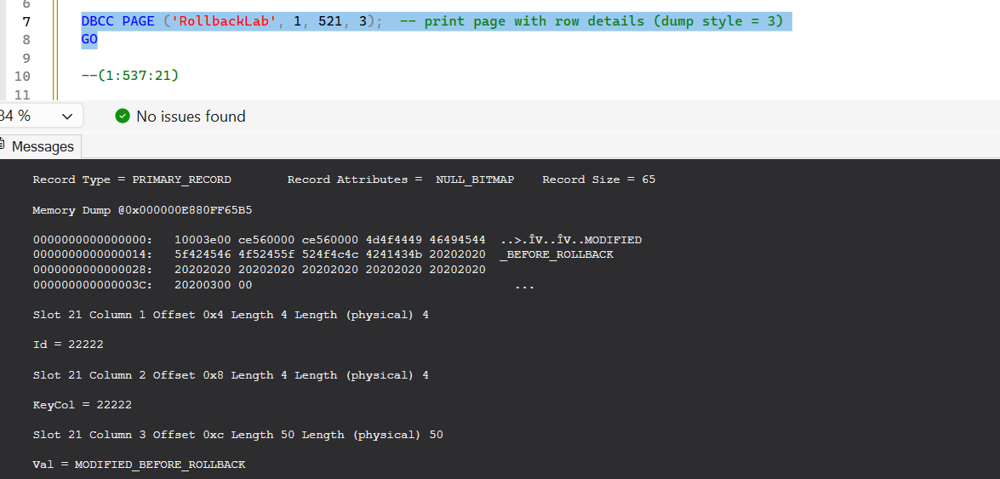

We will also try SELECTing data as a whole. When we SELECT data, as expected, the session gets blocked, since the transaction is still open.

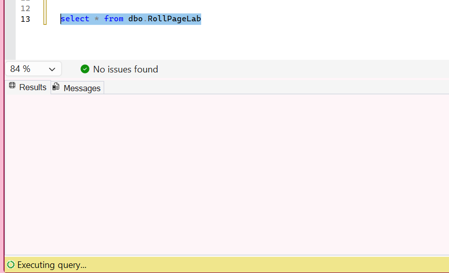

Let's do some dirty reads with NOLOCK...

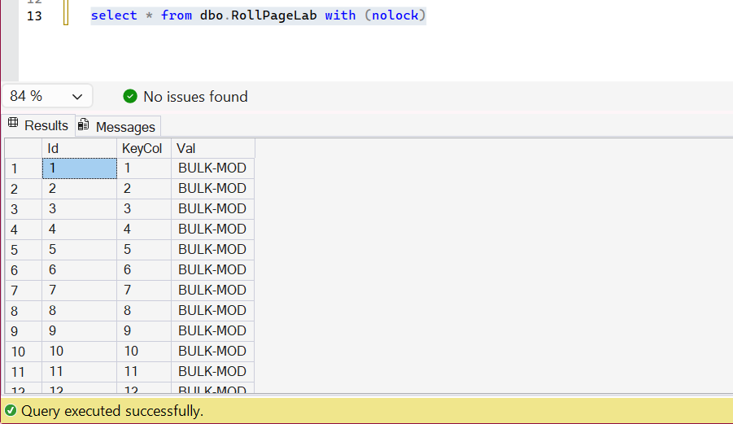

Nice... So we've seen how data looks now, before being committed. Now we can proceed to kill the session(to make things dramatic!) or if the timer has completed, just issue **ROLLBACK**

```sql
kill <spid>
```

Post, killing... Let's peek into the Contents and then come back and take a look at the log records...

The id 22222 has reverted back to ORIGINAL value and all the 1 - 20000 records have also reverted back !!!!

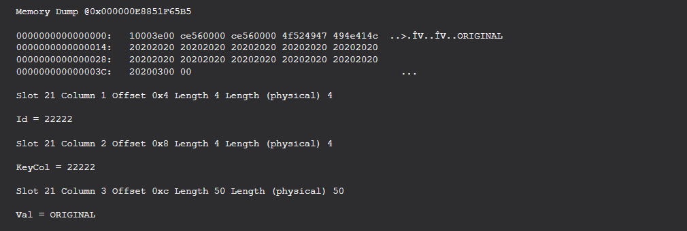


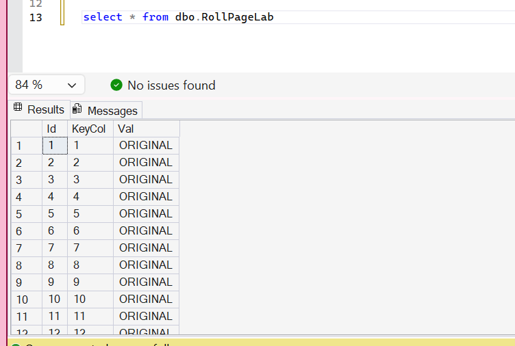


Let's take a look at the transaction log for what happened during the rollback...

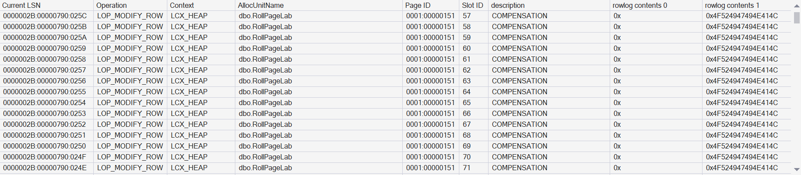

We can see that, there are a lot of records with **COMPENSATION** entry. This means, all the updates have been rolledback, with a compensation log record for each update and rowlog contents (right most column in the Screenshot) tell that the value has been reverted to 'ORIGINAL'

Also, Let's check the count...

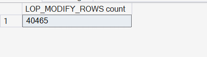

We have exactly double the number of modify log records - one for the actual update and one for the rollback.

Let's also check what happened to the id 22222...

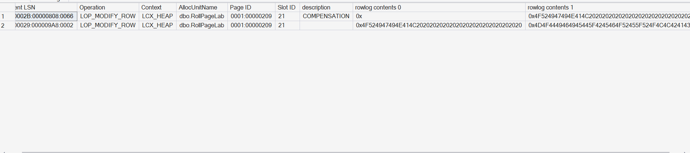

We could see that first the log has been written for 'ORIGINAL' to 'MODIFIED-BEFORE-ROLLBACK' and then the compensation record was written while rollback, to revert it to 'ORIGINAL'.

Another marker to note in the log is the 'XACT' records... for this particular transaction, we have the transaction start and the transaction abort record being written when it was killed\rolledback...

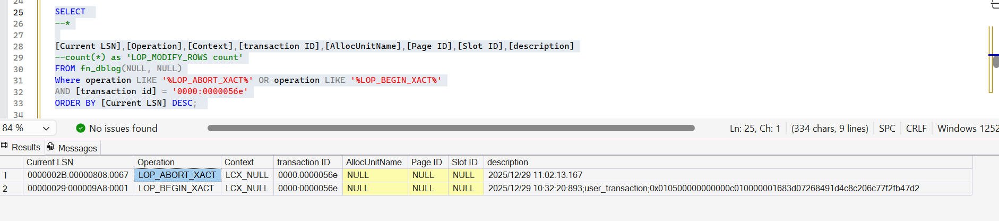

### TL;DR:
Rollback isn’t magic—it’s a logical undo process driven by the transaction log. SQL Server guarantees ACID, so every change is logged before it’s applied (Write-Ahead Logging). When a rollback occurs:

- Transaction Log is the Source of Truth
  - Every modification (insert, update, delete) writes a log record describing the change and its inverse.
  - Log records include LSNs (Log Sequence Numbers) for ordering and recovery.
  - For rollback, SQL Server reads these log records in reverse order (last change → first change).

- Undo Phase
    - For each log record, SQL Server applies the compensating action:
      - If you inserted a row → rollback deletes it.
      - If you deleted a row → rollback re-inserts it (with original values).
      - If you updated a row → rollback restores old values.
     This is called logical undo, not physical undo (it doesn’t just copy a snapshot; it replays inverses).

- Locks During Rollback
  - Locks acquired during the original transaction are held until rollback completes.
Rollback itself may need additional locks to apply undo safely.

- Rollback doesn’t delete log records; it adds new ones for compensation. So the log grows during rollback!
- Rollback is a single-threaded process ! Even if your inserts happened using multiple threads, rollbacks happen using a single thread, that's why they say rollbacks take equal or longer time to happen.
- NOLOCK is a double edged sword... DATA may not be CONSISTENT !

Sorry if I had spammed with a lot of images and if it's a tough one to read... Please let me know if the writing can be improved in any way...

Until Next time, Happy Noodling 😄!
