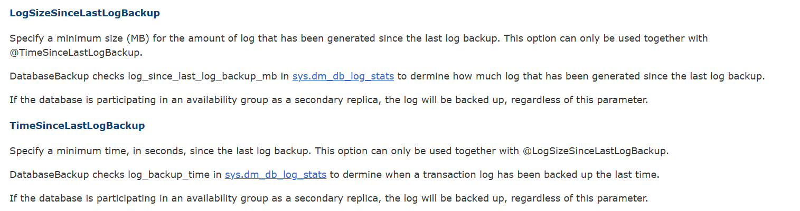
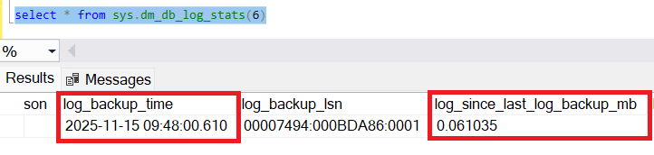
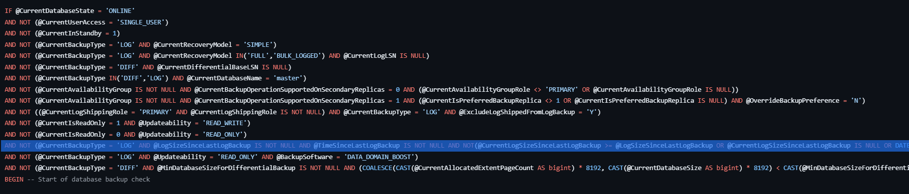

If you've been engaged in production environments for SQL server, There is a high possibility that you might've seen environments using the Ola Hallengren solution for Database Backups and Maintenance. And there's also a possibility that you may be currently using that as well. (Shout out to Ola Hallengren for creating such beautiful software and making it free!)

Well, If you've come across this scenario where sometimes your log backup job completes successfully and still you don't find a log file being created, Scroll below to find out why...

The Log backup job script part contains two important parameters:
- LogSizeSinceLastLogBackup
- TimeSinceLastLogBackup
  
What are these params ? 


So, in the **sys.dm_db_log_stats** DMF, there are multiple columns, out of which, the **log_since_last_log_backup_mb** and **log_backup_time** are taken into consideration for the log backups to happen.

```sql
SELECT *
FROM sys.dm_db_log_stats(DB_ID('YourDatabaseName'));
```



As mentioned in the docs, These params are to be used together and in most cases, according to the individual environment standards, load expected and much more specific stuff they may vary from place to place. 

The exact comparison happens in Line 3055 of the [DatabaseBackup.sql](https://github.com/olahallengren/sql-server-maintenance-solution/blob/main/DatabaseBackup.sql) script.



```sql
 AND NOT (@CurrentBackupType = 'LOG' AND @LogSizeSinceLastLogBackup IS NOT NULL AND @TimeSinceLastLogBackup IS NOT NULL AND NOT(@CurrentLogSizeSinceLastLogBackup >= @LogSizeSinceLastLogBackup OR @CurrentLogSizeSinceLastLogBackup IS NULL OR DATEDIFF(SECOND,@CurrentLastLogBackup,SYSDATETIME()) >= @TimeSinceLastLogBackup OR @CurrentLastLogBackup IS NULL))
```


As an example, let us set some values and go through stuff...

- LogSizeSinceLastLogBackup = 300MB
- TimeSinceLastLogBackup = 120 Mins

If the log backup job is scheduled to run every 15 - 30 mins, These two params are checked and if the log_since_last_log_backup_mb is greater than the input param - 300MB, then the log backup is proceeded.

If, for multiple runs, the log_since_last_log_backup_mb stays less than the threshold and it does'nt grow, the TimeSinceLastLogBackup param steps in, and log backups are guaranteed to be taken 120 Mins after the log_backup_time.


Check this out in your environment and Noodle more on this!

