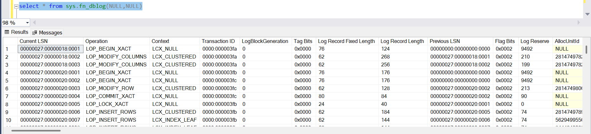
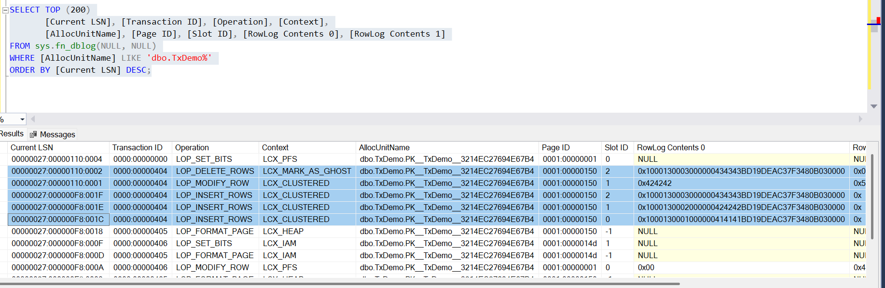
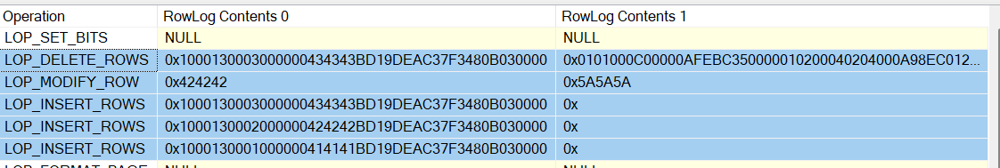
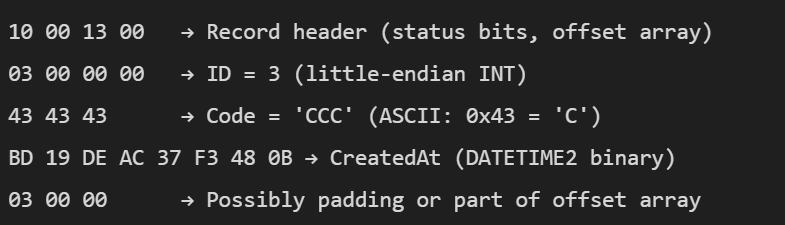

For long, I've been having this curiosity as to what's inside the SQL server transaction log(s) for a database. I hope many of you might've had that thought as well. Let's just get our feet wet, if at all we're not able to be drenched in the depths of the transaction log 😄.

To do that, we need to get our hands dirty and use undocumented SQL server functions and commands. These are not supported by Microsoft and are not meant to be used in production environments and they are not the regular good old functions\commands. 

Two of those are:
- DBCC LOG :
  - Reads the transaction log of a database and shows log records at varying levels of detail.

```sql
DBCC LOG('YourDatabaseName', [detail_level]);
```
- sys.fn_dblog
  - Reads active log records in the current database in a queryable format.
  
```sql
SELECT * FROM sys.fn_dblog(NULL, NULL);
```

The **DBCC LOG** though helpful and provides a lot of details, won't be comfortable for querying and filtration. The **sys.fn_dblog** function provides more details and flexibility and a lot more scope for playing around. 

The **sys.fn_dblog** function returns more than 120 columns and gives us a lot of granularity as to how we can look into the logs.



Key Columns:

- Current LSN: Unique log record ID
- Operation: Type of log record
- Context: e.g., LCX_HEAP, LCX_CLUSTERED
- Transaction ID: Links all ops in a transaction
- AllocUnitName: Table/index affected
- RowLog Contents 0/1/2: Row image in hex
- Page ID, Slot ID: Row location
- Begin Time, End Time: Transaction timing
- Transaction Name: If marked with WITH MARK

Let's quickly spin up a test env and noodle around...

```sql
CREATE DATABASE LogLab

ALTER DATABASE LogLab SET RECOVERY FULL;

USE LogLab;
GO

CREATE TABLE dbo.TxDemo
(
    ID INT IDENTITY(1,1) PRIMARY KEY,
    Code CHAR(3) NOT NULL,
    CreatedAt DATETIME2 NOT NULL DEFAULT SYSUTCDATETIME()
);
GO
```

Once we're done with the creation part, Let's just do some DML and see how the logs look...

```sql
-- Begin a transaction – we’ll leave it open to observe the log
BEGIN TRAN t1;

INSERT INTO dbo.TxDemo (Code) VALUES ('AAA'), ('BBB'), ('CCC');

-- Update a row
UPDATE dbo.TxDemo SET Code = 'ZZZ' WHERE ID = 2;

-- Delete a row
DELETE FROM dbo.TxDemo WHERE ID = 3;

```
The only thing that we're inserting\Deleting\updating in this table is going to be the 'Code' column.

After running all the DMLs together, let's dig through logs to see how things have come out.

```sql
SELECT TOP (200)
       [Current LSN], [Transaction ID], [Operation], [Context],
       [AllocUnitName], [Page ID], [Slot ID], [RowLog Contents 0], [RowLog Contents 1]
FROM sys.fn_dblog(NULL, NULL)
WHERE [AllocUnitName] LIKE 'dbo.TxDemo%'
ORDER BY [Current LSN] DESC;
```



We've done three inserts, one update and a delete (in that order*). When we see the highlighted part of the query output, we can see those operations being logged in that order.

On the outset, these may look a bit intimidating. But when we look closely at the output, we it makes a bit sense.

- LSN depicts the log sequence number.
- Transaction ID - ending 404, is the ID of the transaction 't1' in which we ran all these statements
- Operation - depicts INSERT\UPDATE\DELETE
- Context - This operation is happening on the Clustered Index Datastructure
- AllocUnit - The name of the object.
- Page and slot ID depicts the respective page and slot number where the rows are present.
  
Let's closely look at the row log entries.



The Data is actually in front of us, that's the most beautiful part !
But, But... It is in Hex !

Let's just take one row log entry '0x1000130003000000434343BD19DEAC37F3480B030000' and piece out the hex.



if you look closely the inserts will have '414141', '424242', '434343' which are our A,B and C.

The Modify row will have 'B' modified into 'Z'

The Delete will have 'C' being removed and marked as ghost record.

We have just scratched the surface in this experiment. We can do more posts on this topic involving how log reacts to ALTER INDEX and PARTITIONing kinda stuffs...

Keep noodling...

