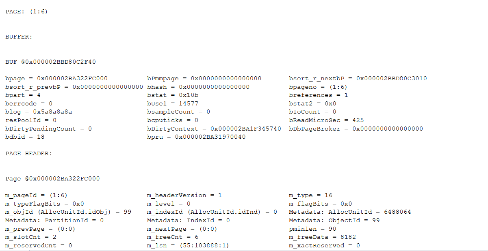
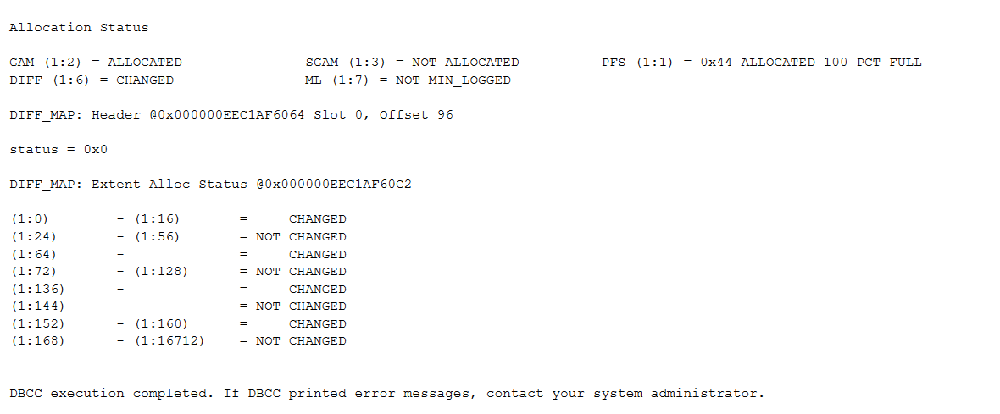
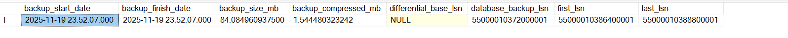
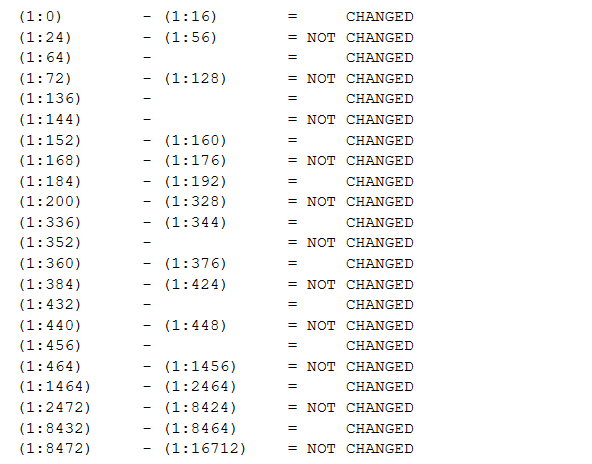
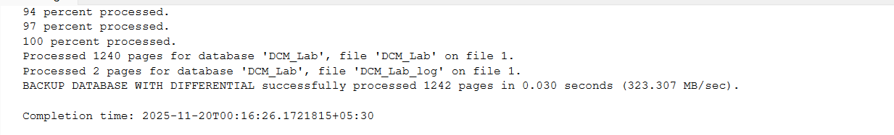
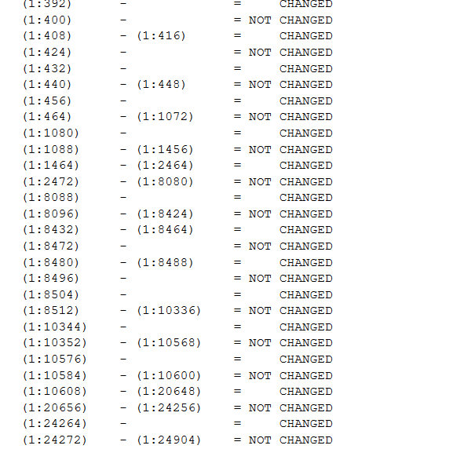
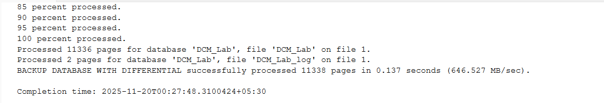
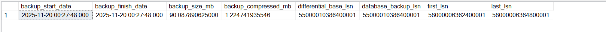
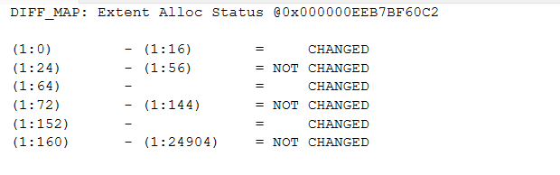

Ever wondered how a differential backup works and why it depends on a full backup ? Instead of briefing about what happens during a backup, the types of backup and stuff, I'd just wanted to jump right into this content (May be all of those may come on a different post 😉).

End of the day, a full backup needs to consider all the pages that are in the database. So what will a differential backup consider then ? Obviously, The pages that changed after that...

Keeping track of pages, will take more efforts and will be more costly to do. Instead, SQL server keeps tracks of extents(Collection of 8 Pages) as a whole, such that, if any page in a extent is touched, the whole extend is marked as changed.

This is done through a bitmap datastructure called as the **differential change map**. These are special pages (like other special pages - GAM,SGAM,IAM). Each DCM page can cover upto 64,000 extents (which is roughly 4 GB of data). If an extent has changed, its bit in the DCM page is set to 1. When you take a differential backup, SQL Server reads DCM pages to know which extents need to be backed up. This makes differential backups **much faster** than full backups.

Each of these special pages appears every 511,232 pages (which is 64,000 extents × 8 pages per extent). Since each page is 8 KB, that means every ~4 GB of data you get one DCM page.

### Why can one DCM page cover 64,000 extents?

- Each extent = 8 pages = 64 KB.
- 64,000 extents × 64 KB = 4 GB.
- A DCM page is 8 KB and stores 1 bit per extent:
- 8 KB = 8 × 1024 bytes = 8192 bytes.
- 8192 bytes × 8 bits = 65,536 bits.
- So a single DCM page can track up to 64,000 extents (slightly less than 65,536 because some bits are reserved for internal use).


This design is efficient: **one page** can represent the change status for a huge chunk of the database.

### Let's get our feet wet and see what happens under the hood...

To create the environment for experimenting this, let's create the 'DCM_Lab' Database and a large table under that database.

```sql

IF DB_ID('DCM_Lab') IS NOT NULL
BEGIN
    ALTER DATABASE DCM_Lab SET OFFLINE WITH ROLLBACK IMMEDIATE;
    DROP DATABASE DCM_Lab;
END
GO

/* ================================
   1) Create DB + table and seed data
==================================*/
CREATE DATABASE DCM_Lab;
GO
ALTER DATABASE DCM_Lab SET RECOVERY FULL; -- so we can take log/diff backups normally
GO
USE DCM_Lab;
GO

--  big enough to span multiple extents
CREATE TABLE dbo.BigRows
(
    id INT IDENTITY(1,1) PRIMARY KEY,
    filler CHAR(4000) NOT NULL DEFAULT REPLICATE('X',4000)
);
GO
```

Let's Insert some data into the table.

```sql
-- Insert ~10,000 rows to allocate many extents (each extent = 8 pages, each page 8KB)
INSERT INTO dbo.BigRows DEFAULT VALUES;
GO 10000  -- 10K rows

SELECT * FROM dbo.BigRows -- for testing purposes

CHECKPOINT; -- flush pages
GO
```
Okay, Now the setup being done... Let's take an initial full backup.

```sql
/* ================================
   Take a full backup (resets DCM)
==================================*/
BACKUP DATABASE DCM_Lab
TO DISK = N'C:\Program Files\Microsoft SQL Server\MSSQL16.MSSQLSERVER\MSSQL\Backup\DCM_Lab_First.bak'
WITH INIT, STATS = 5, COMPRESSION;
GO
```

Now comes the magic, Let's peek into the DCM page. For this, we will use the **DBCC PAGE** command (yes, another undocumented command!).

```sql
DBCC TRACEON(3604); -- TRACEON(3604), you get the full decoded page info (headers, slot array, DCM bitmap, etc.) right in your query output, usually DBCC PAGE writes to the error log.
GO

DBCC PAGE ('DCM_Lab', 1, 6, 3) -- (DB,fileID,pageID, output_verbosity)
GO

```

Running this, will give the below output, having a lot of metadata about the page itself.



And below comes the beautiful part, the allocation and the details about which ranges of extents have been touched or not.



Extents from 168 - 16172 have'nt been touched.

Also, Let's see the full backup size.

```sql
SELECT TOP(1)
    b.backup_start_date, b.backup_finish_date,
    b.backup_size/1024.0/1024.0 AS backup_size_mb,
    b.compressed_backup_size/1024.0/1024.0 AS backup_compressed_mb,
    b.differential_base_lsn, b.database_backup_lsn,
    b.first_lsn, b.last_lsn
FROM msdb.dbo.backupset b
WHERE b.database_name = 'DCM_Lab' AND b.type = 'D'  -- I = differential
ORDER BY b.backup_finish_date DESC;

```



Now, Let's update some data and see how things look.

```sql
/* ================================
   Make targeted changes after full
      (these will flip DCM bits to 1)
==================================*/
-- Touch ~2,000 rows (will dirty many extents)
UPDATE dbo.BigRows
  SET filler = REPLICATE('Y',4000)
WHERE id BETWEEN 2001 AND 4000;

CHECKPOINT;
GO
```

Running the DBCC PAGE command for the DCM page after running this update will produce the below output.



Wow !, multiple RANGES of extents have been modified.

Let's take a differential backup here and note it.




We have touched a whopping 1240 pages in our update statement! and the backup size is around 11MB(uncompressed).

Let's try a second set of inserts (20000 more rows) and see how it affects the differential backup.



if you remember from above, we had around 16K pages before, now we have more than 20K. We've been allocated new pages.

let's take the backup and check the page changes and the backup size change since the full backup.





Well, well, what do we have here ? We have modified around 11K pages and our uncompressed differential backup size is around 90MB (larger than the full backup !).

Let's take a final full backup, which will reset the DCM bits. Remember, COPY ONLY does not reset the DCM bits !



Well, that's that... We dealt with so much pages and stuff today. Check out this [blog](https://sqlity.net/en/2033/the-page/) from sqlity where they have explained extensively about the page and so much in the internals of a page and storage internals (Shout out to those guys!).

Happy Noodling !

