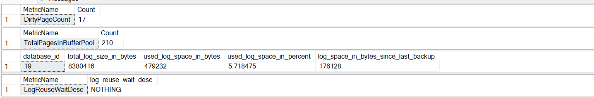
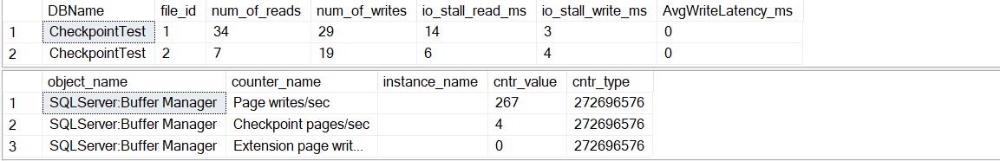
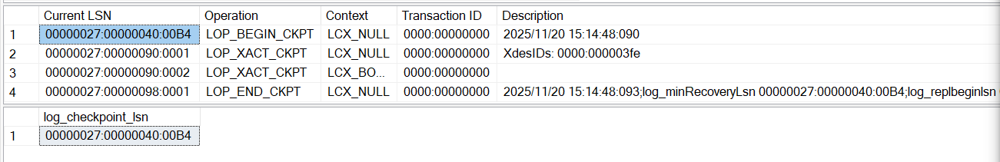
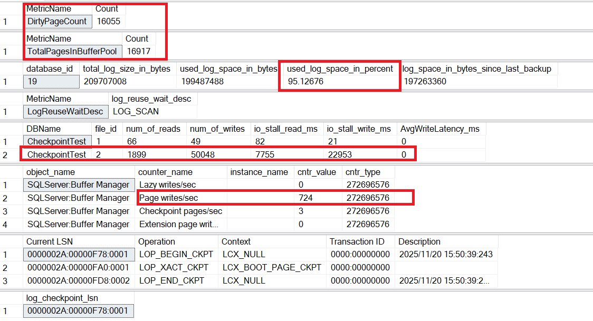
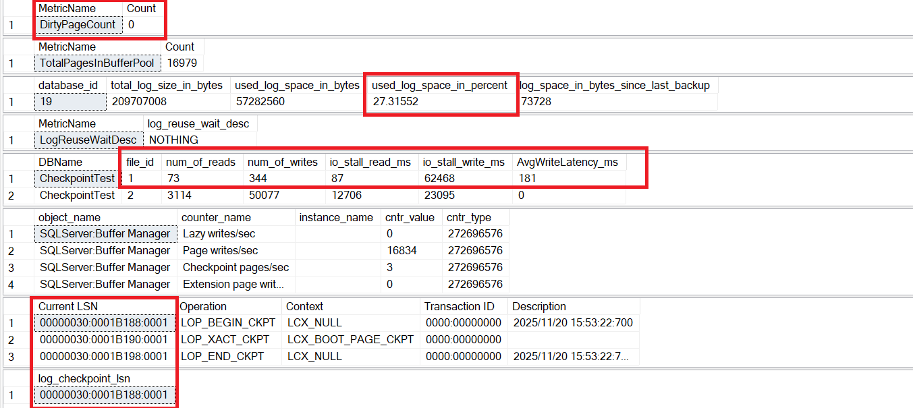
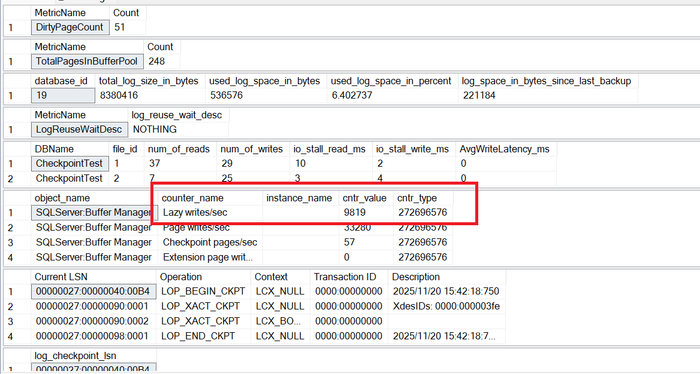

## What is a Checkpoint ?

Since all operations happen in memory, they need to be persisted on to the disk and this persistence/flushing operation can't be done after every modification, which may be costly. SQL server uses an internal process called the **CHECKPOINT** to flush the dirty pages from memory to disk and also records a checkpoint log record in the Transaction log.

### Why is this important ?

- This process is very critical for database crash recovery. As SQL server uses WAL (Write Ahead Logging) where changes are first written to the transaction log before being written to the data pages themselves.
- If SQL server crashes due to some unforeseen cirumstances, recovery is done by scanning the log to REDO the committed transactions and UNDO the uncommitted transactions.
- Without CHECKPOINTs, recovery would require scanning the entire log since the last database start. Checkpoints reduce recovery time by marking a point where all changes before that are persisted.

### What happens during a checkpoint?

- Flush dirty pages from buffer pool to disk.
- Write a checkpoint record in the transaction log.
- Update the Minimum Recovery LSN (or log_recovery_lsn) so older log records can be truncated.
- Does not shrink the log file, but frees space for reuse.
- Can be triggered:
   - Automatically (based on recovery interval).
   - Manually (CHECKPOINT command).
   - Indirectly (e.g., backup, shutdown).


All said and done, let's just see how some metrics change before and after the CHECKPOINT is issued, just to give us some visual aid that some things are being moved when CHECKPOINT is issued. 

Since we mentioned that CHECKPOINTs happen automatically, we need to stop that for our experiment, so that the engine does'nt do CHECKPOINTs and interfere with our experiment. 

#### How do we do that ?

```sql
EXEC sp_configure 'recovery interval', 32767;
```

Recovery interval in SQL Server is the setting that defines the target time (in minutes) for crash recovery, which SQL Server uses to decide how frequently to run automatic checkpoints; a value of 0 means SQL Server determines the interval dynamically based on workload.

By setting the **'recovery interval'** to a very high value, we are just bypassing it to not do stuff when we are working on things. It's default value is 0, where the engine will decide on the CHECKPOINT frequency and automatically issues it internally.


Let's setup the env for experimenting...

```sql
  CREATE DATABASE CheckpointTest;
  ALTER DATABASE CheckpointTest SET RECOVERY FULL
  
  USE CheckpointTest;

  CREATE TABLE TestData (
      ID INT IDENTITY(1,1),
      Data CHAR(2000) DEFAULT REPLICATE('X',2000)
  );
```

Let's take the baseline numbers after creation of the Database and tables for reference

```sql
USE CheckpointTest;  -- Switch to your database
GO

/* ============================================================
   1. Count of Dirty Pages in Buffer Pool
   ------------------------------------------------------------
   Dirty pages = Pages modified in memory but not yet written
   to disk. A checkpoint flushes these to disk.
============================================================ */
SELECT 'DirtyPageCount' AS MetricName,
       COUNT(*) AS Count
FROM sys.dm_os_buffer_descriptors
WHERE database_id = DB_ID() AND is_modified = 1;


/* ============================================================
   2. Total Pages in Buffer Pool for this Database
   ------------------------------------------------------------
   Gives you the total pages currently cached for this DB.
============================================================ */
SELECT 'TotalPagesInBufferPool' AS MetricName,
       COUNT(*) AS Count
FROM sys.dm_os_buffer_descriptors
WHERE database_id = DB_ID();


/* ============================================================
   3. Transaction Log Space Usage
   ------------------------------------------------------------
   Shows total log size and used space in KB.
   Useful to see how much log space is consumed before/after checkpoint.
============================================================ */
SELECT * FROM sys.dm_db_log_space_usage;


/* ============================================================
   4. Log Reuse Wait Description
   ------------------------------------------------------------
   Tells why log space cannot be reused yet.
   Common values:
     - NOTHING: No wait
     - CHECKPOINT: Waiting for checkpoint
     - LOG_BACKUP: Waiting for log backup
============================================================ */
SELECT 'LogReuseWaitDesc' AS MetricName,
       log_reuse_wait_desc
FROM sys.databases
WHERE database_id = DB_ID();


/* ============================================================
   5. I/O Stats for Data and Log Files
   ------------------------------------------------------------
   Shows number of reads/writes and stall times.
   Useful to measure I/O activity during checkpoint.
============================================================ */
SELECT DB_NAME(database_id) AS DBName,
       file_id,
       num_of_reads,
       num_of_writes,
       io_stall_read_ms,
       io_stall_write_ms,
       CASE WHEN num_of_writes > 0
            THEN io_stall_write_ms / num_of_writes
            ELSE 0 END AS AvgWriteLatency_ms
FROM sys.dm_io_virtual_file_stats(DB_ID(), NULL);


/* ============================================================
   6. Performance Counters for Page Writes and Checkpoint Pages
   ------------------------------------------------------------
   Shows how many pages are written per second and checkpoint activity.
============================================================ */
SELECT * FROM sys.dm_os_performance_counters
WHERE counter_name LIKE '%Page writes/sec%'
   OR counter_name LIKE '%Checkpoint pages/sec%';


/* ============================================================
   7. Transaction Log Records for Checkpoint
   ------------------------------------------------------------
   fn_dblog lets you inspect log records.
   Filter for checkpoint operations.
============================================================ */
SELECT [Current LSN],
       [Operation],
       [Context],
       [Transaction ID],
       [Description]
FROM fn_dblog(NULL, NULL)
WHERE [Operation] LIKE '%CKPT%';


/* ============================================================
   8. Current Checkpoint LSN
   ------------------------------------------------------------
   Shows the LSN where the last checkpoint occurred.
============================================================ */
SELECT log_checkpoint_lsn
FROM sys.dm_db_log_stats(DB_ID());

```







Let's do a bulk insert now...

```sql
  INSERT INTO TestData DEFAULT VALUES;
  GO 50000
```

During the insert, I just took a snap of the metrics...



And... as expected, the number of **dirty pages** has significantly **gone up**. Also, the log space used has increased and number of writes to FILE 2 - (Log File) has also increased.
and the page writes\sec has also increased.


Let's hit the magikkk word 😉...

```sql
CHECKPOINT
```


#### POST CHECKPOINT: 
- **ALL** dirty pages have been flushed to disk.
- Log space used percent has decreased, meaning, free space inside the log has become reusable.
- All write metrics to the FILE ID 1 - Data file has gone up, since the pages are flushed from mem to disk.
- log_recovery_lsn has moved forward, so older log records have been truncated(hence the free space in log), if the database crashes here, it can recover post this bulk INSERT, since this has been persisted to disk and all the load on the log has been removed.


 You may feel that why the Log file has more writes than the data file, even I felt that ! The thing is that, for logs, every single statement needs to be written onto the log file (for obvious reasons - crash recovery, UNDO, REDO kinda stuff). But data file is written in PAGES. So, everything gets neatly organized according to pages in memory and is flushed to disk, so that you get to deal with that number of data in that number of physical page writes.

### Bloopers 😆

I had initially planned and did the INSERT a 100,000 times. Which... kind of did work. But, but, something else also had happened.



Turns out, I strangled the buffer and created memory pressure (I dunno how that happened !), the **lazy writer** kicked in and started flushing out the pages ! That was something that did not hit me that it could happen, and it just was an uninvited party spoiler for the experiment 😅!  I had to redo the experiment by reducing the insert to 50,000 , deleting everything and restarting the service to maintain cleanliness.

More on that maybe on another post !

Until then, Happy Noodling 😄!

