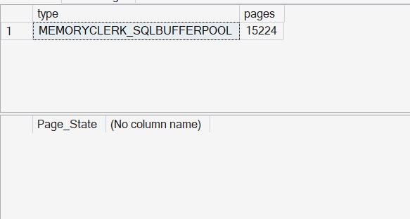
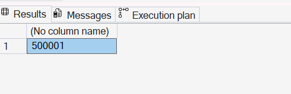
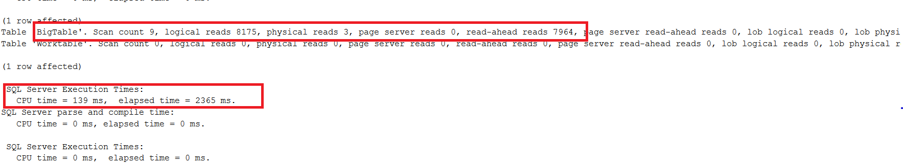
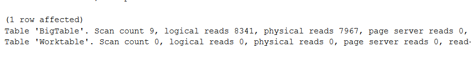
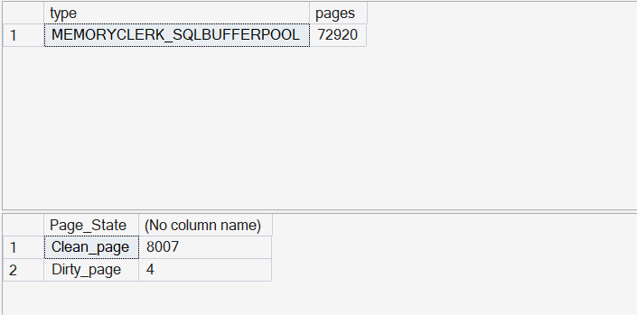
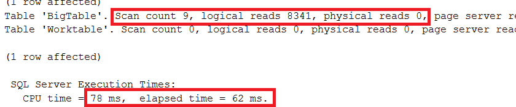

If you had been through some basic computer science classes, you'd have definitely seen this chart [(Latency numbers every programmer should know)](https://gist.github.com/jboner/2841832) 👇.


Any computer program designed \ created will keep one factor in mind : 
**Latency**. Every programmer should know the cost of accessing different resources—CPU cycles, memory, disk, and network—and optimize accordingly.

SQL server is no different, it uses **BUFFER CACHE - a memory area that stores frequently accessed data pages**. This dramatically **reduces latency** for subsequent queries because they can read from memory instead of disk.


### What is DROPCLEANBUFFERS ?

Nah, nothing that complex, it is a DBCC command that clears the clean pages from the buffer cache.

##### What is a clean page ?
- A clean page is a page in the buffer cache that **matches what's on disk**.
- It has **not been modified** since it was read from disk.
- If SQL Server needs memory, clean pages **can be discarded without writing back to disk** because the disk copy is already up-to-date.
- Ex - You run a SELECT query → pages are read into memory → no changes → they remain clean.

#### On the contrary, What is a dirty page ?
- A dirty page is a page in the buffer cache that has been **modified but not yet written to disk**.
- Occurs when we run INSERTs\UPDATEs\DELETEs.
- Dirty pages must be flushed to disk during:
  - CHECKPOINTs
  - Lazy writer stepping in.
  - Database shutdown
- You update a row → page in memory changes → disk copy is stale → page is dirty. 

Let's experiment into what happens when we run DBCC DROPCLEANBUFFERS.

```sql
USE AdventureWorks2022_CacheTest;
GO

-- Step 1: Setup Big Table
IF OBJECT_ID('dbo.BigTable') IS NOT NULL DROP TABLE dbo.BigTable;

CREATE TABLE dbo.BigTable (
    ID INT IDENTITY(1,1) PRIMARY KEY,
    RandomText CHAR(100) DEFAULT REPLICATE('X', 100)
);
```

Then, INSERT some decent amount of rows into the table...(I would suggest around 500,000 rows into the table. But, do it in parts, cause it may end up running forever.)

```sql
-- Insert 500,000 rows
INSERT INTO dbo.BigTable DEFAULT VALUES;
GO 100000
-- run it 5 times or modify the number and run it in pieces or if you have the confidence that your machine has the mental strength to run 500000 times, Go Ahead ! 
```

Once you've INSERTED, I'd suggest, run CHECKPOINT with DBCC DROPCLEANBUFFERs to get a baseline of the state of the buffer cache.

```sql
--DROP BUFFERS
CHECKPOINT;
DBCC DROPCLEANBUFFERS;
```

Then, Get the baseline metrics

```sql
/* 
This query tells us how much memory the SQL Server instance is currently using 
for the Buffer Pool (i.e., the cache that holds data and index pages in memory).
*/

SELECT 
    type,                 -- Memory clerk type; 'BUFFERPOOL' is the one that backs data page caching
    SUM(pages_kb) AS pages -- Total KB allocated by this clerk; useful to gauge cache footprint
FROM sys.dm_os_memory_clerks
WHERE type LIKE '%BUFFERPOOL%' -- Filter to just buffer pool related memory clerks
GROUP BY type;


/* 
Shows, for the specific database, how many pages in the buffer cache are currently:
- Clean: Match disk (can be evicted without write)
- Dirty: Modified in memory and not yet persisted to disk

- DBCC DROPCLEANBUFFERS only removes *clean* pages. Dirty pages remain until CHECKPOINT writes them.
- This helps you verify whether your cache is truly 'cold' after experiments 
  and understand write pressure / pending flushes.

Notes:
------
- Each row in sys.dm_os_buffer_descriptors represents one 8 KB page in the buffer cache.
- You can multiply COUNT(*) by 8 to calculate total KB, or divide by 128 to get MB.
*/

SELECT 
    CASE 
        WHEN is_modified = 1 THEN 'Dirty_page'  -- Changed in memory; disk copy is stale
        WHEN is_modified = 0 THEN 'Clean_page'  -- Matches disk; safe to evict
        ELSE 'Unknown'
    END AS Page_State,
    COUNT(*) AS PageCount                        -- Number of cached pages in this state
FROM sys.dm_os_buffer_descriptors
WHERE database_id = DB_ID('AdventureWorks2022_CacheTest')  -- target database
GROUP BY is_modified;
```

Feel free to skip all the comments, and copy only the lines of code (Please do read them though 😅).

Then comes the main metrics catchers

```sql
SET STATISTICS IO ON;
SET STATISTICS TIME ON;
```

SET STATISTICS IO ON; and SET STATISTICS TIME ON; are session-level settings in SQL Server that help you analyze query performance by showing detailed metrics in the Messages tab of SSMS.

- **IO stats**: tells you **how much work** SQL Server did at the **storage/memory level**. 
- **Time stats**: tells you **how long it took** and how much CPU was consumed.

#### Baseline metrics (post INSERTION and checkpoint and DROPCLEANBUFFERS):


Now, We have a **cold cache** (Pages are not in the buffer cache, they need to be fetched from disk if they are needed.)

Let's run the SELECT...

```sql
-- Cold Cache Run
PRINT 'Cold Cache Run';
SELECT COUNT(*) as output FROM dbo.BigTable;
```



Forgive me for not naming the output column, was lazy though 😅...

let's see what the messages are saying...



> Table 'BigTable'. Scan count 9, logical reads 8175, physical reads 3, page server reads 0, read-ahead reads 7964 ...

>  SQL Server Execution Times:
   CPU time = 139 ms,  elapsed time = 2365 ms.

Okay... What do these mean ?

All IO units are pages, So let's put it this way... When we're running the SELECT to get all the rows, we're touching almost 8000 pages.

#### Now coming to the specifics:
- We need to come from right, Since these pages were not in the buffer, there were 7964 read ahead reads (Similar to physical reads, more on that below).
- It had to fetch these pages from disk and then give it to us.

**Read ahead reads are an optimization mechanism** used by SQL server, We'll Switch that off for now to keep things clean and re-visit that later.

```sql
DBCC TRACEON (652);
```

Now just run the checkpoint + DROPCLEANBUFFERS again (to make the cold cache condition) and then rerun the SELECT.



#### How to interpret ?
- Logical reads: 8341 → Pages read from buffer cache.
- Physical reads: 7967 → Pages fetched from disk (high, suggests cold cache).

Most of the reads had to **spill to disk** to read the pages, which **cost us more than 2 seconds (Which is a significantly large number in performance terms!)** for just fetching 500000 simple rows. This is exactly why disk reads are costly, and at production scale, such scenarios can hurt a lot.

Let's also check the other memory metrics:



You can see a **significant increase in the amount of pages in the buffer cache** both at the instance and the database level, compared to the baseline level that we saw at the start.

Now that we saw the cold cache performace, Since **all the pages are available** in the buffer cache now, We have what is called as **Warm cache**...

Let's run the SELECT now and see the Time and IO Stats...
```sql
-- Warm Cache Run
PRINT 'Warm Cache Run';
SELECT COUNT(*) as output FROM dbo.BigTable;
```



Woah!!! That's some impressive performance 🤩...

#### How to interpret ?
- We have around 8300 logical reads and **Zero** physical reads, which means everything came from memory
- Timing elapsed wise, we dropped from **2.3 seconds to 0.063 seconds**, which is a **97% performance boost !!**

Well, that shows the power of caching and also, how cautious we need to be while using the DBCC DROPCLEANBUFFERS in production environments.

### Bonus content - Read ahead reads:

Somewhere in the middle, we had some interference in the page fetches by these read ahead reads, where **we expected physical reads**, What are those anyway ?

- When SQL Server executes a query that needs to scan a large portion of a table or index, it predicts which pages will be needed next and preloads them into the buffer cache **before the query actually requests them.**
- This is done by the **read-ahead mechanism**  - a storage‑engine optimization , which **reduces wait time** because the data is already in memory when the query needs it.
- SQL server does this **because Disk I/O is slow compared to memory access**. If SQL Server waited for each page request during a scan, **performance would tank**. So it reads ahead in chunks (usually **64 continuous pages = 512 KB**) to keep the pipeline full.
- It happens in places like **Table scans or index scans (large sequential reads), or places where parallel queries in multiple threads need data or in Bulk DMLs**

That was a lott of typing for me, would be happy if you had learnt something new out of this one... cause I learned a lot!

Until next time, Happy Noodling 😄!
