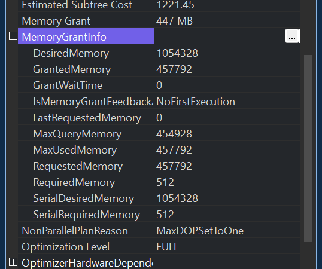
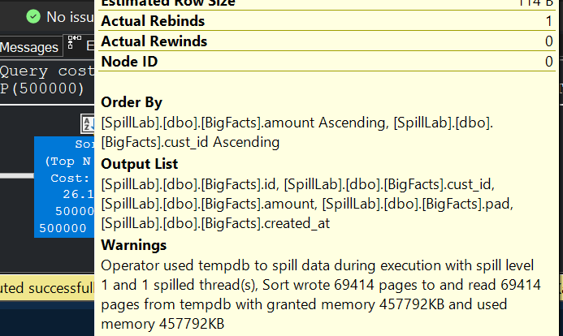
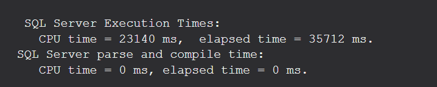
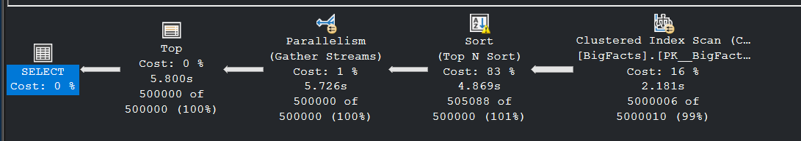
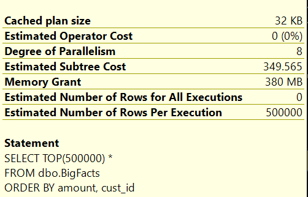
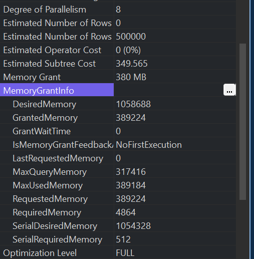
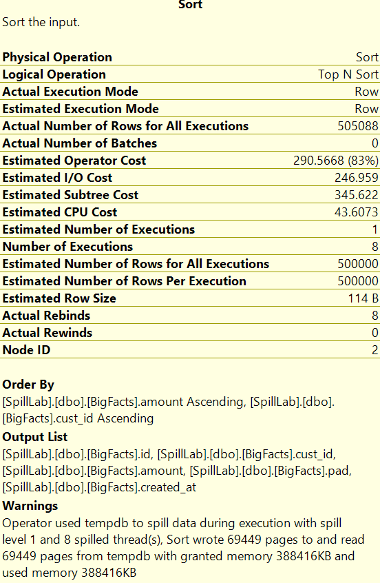
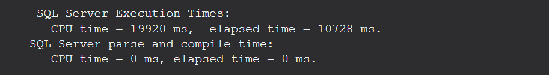

We're going to see a lot of different topics and how they interact when together in this post, We're just going to touch on serial and parallel plans, what are spills, what are memory grants and a lot of stuff... So that we can make more meaning out of the experiment...

### What is Memory Grant ?

Memory grant is just a chunk of memory reserved for our query **before** the query starts running, so that all the operators can operate in memory instead of spilling to disk.

#### Why do we need Memory Grant ?
Some operators need extra memory to build internal structures for operations\Calculations.
- Sort → needs memory to hold rows while sorting.
- Hash Join → needs memory for hash tables.
- Hash Aggregate → needs memory for grouping buckets.

If they dont get enough memory, they need to intermediate data to disk(This is where spills and tempdb comes in).

#### How is the grant decided ?
BEFORE execution, the optimizer estimates the Row size, Row count and Operator type. Based on this, it requests a memory grant.

#### Who grants all this stuff ?
There is an internal traffic controller called the **RESOURCE SEMAPHORE**, that thing, acts like a gatekeeper for memory(Since there is no infinite memory and only limited memory is available).

The RESOURCE SEMAPHORE decides:
- Who gets memory (based on priority and available memory).
- How much memory each query gets.
- If memory is tight, queries may wait on the Resource Semaphore (aha! that's the RESOURCE_SEMAPHORE wait type).
- Check this out to know more about [RESOURCE_SEMAPHORE waits](https://www.mssqltips.com/sqlservertip/2827/troubleshooting-sql-server-resourcesemaphore-waittype-memory-issues/#:~:text=Resource%20Semaphore%20attempts%20to%20grant,a%20query%20returns%20reserved%20memory.)


Okay... Let's move to the next part...

### What are Serial and Parallel execution ?

#### Serial execution:
This is where one thread does all the work, operates on rows one by one. Nothing is split among others. Hence, it is naturally slow and takes time for Big Data... Also, The query plan will look fairly simple and will not surprise you.

**Think of it as _one student_ sitting on a table and sorting a hugeee pile of exam papers, all by him or herself 😪** 

#### Parallel execution:
This is where there are multiple threads to share the work. Here, DATA is split into CHUNKS and each THREAD processes it's chunk. It uses special operators called **exchange operators** to **distribute and gather rows**. Since many threads are working, queries using parallelism tend to complete faster... But for larger data, there may be issues like skewing(one or some data being present in large fraction out of the whole data) and memory slicing.

**Think of it as _eight students_ sitting together and sorting a hugeee pile of exam papers, splitting and sorting and finally merging  their paper pile💪** 

Okay... Nice... Next thing...

### What's a spill ?
A spill is when an operator like a SORT, HASH Join or a Hash aggregate(GROUP BY) cannot complete its operation within the memory granted for the query, and ends up writing the intermediate results to tempdb.

#### Why ?
Either due to insufficient memory grant in the first place (due to underestimation of row counts / row sizes) or simply because during execution of multiple queries, there is not enough available memory.

### Why did I speak about allll this ?
Yeah, am coming there, in today's experiment, we're just gonna see how and why sometimes spills happen in parallel plans and not in serial plans, the trade offs of time vs memory vs disk I/O and those kinda stuff...

#### Serial vs Parallel: What changes ?
Memory Grants for Serial and Parallel query plans are just wonky science...Simply put, Memory grants are educated guesses by the optimizer—they can vary with plan shape, degree of parallelism, and estimation accuracy. Sometimes, parallel plans get more memory. Sometimes less.

##### Single Threaded (MAXDOP 1):
- One memory grant for the whole plan (As told above, sometimes serial and parallel plans get the same amount of memory and how that memory is consumed makes the difference.)
- If a Sort/Hash underestimates memory needs, one big spill happens.
- The main thing here is that, There won't be any multiple threading overheads where I need to maintain some thread level metadata, and metadata about how the entire data is being split among threads and is being operated... That will bring in more cost.

##### Parallel (MAXDOP 4 or 8):
- Memory is still granted once for the statement, but each thread’s operator instance uses a slice of memory.
- If there is disproportion in the amount of data being handled by the threads (say you have 5M rows and 8 threads and due to unequal distribution, 2 threads handle more than 750K rows, those threads end up spilling to tempdb).
- 50MB being used by one single thread and 50MB spread among 8 threads, has a difference and they may not have sufficient memory to complete their desired operation (SORT\ Aggregation) and end up spilling.
- Also, exchange operators too consume memory (The ones that split and merge the data).


### Okay, Enough of theory. Let's start the experiment.

Let's Create the environment...

```sql

-- Clean slate
IF DB_ID('SpillLab') IS NOT NULL DROP DATABASE SpillLab;
CREATE DATABASE SpillLab;
GO
USE SpillLab;
GO

-- Fact-ish table
CREATE TABLE dbo.BigFacts
(
    id        INT IDENTITY(1,1) PRIMARY KEY,
    cust_id   INT NOT NULL,
    amount    DECIMAL(12,2) NOT NULL,
    pad       CHAR(50) NOT NULL DEFAULT REPLICATE('X',50),
    created_at DATETIME2(0) NOT NULL DEFAULT SYSDATETIME()
);

-- Dimension-ish table
CREATE TABLE dbo.Customers
(
    cust_id INT PRIMARY KEY,
    segment INT NOT NULL
);

-- Seed Customers: 100k
WITH C AS (
    SELECT TOP (100000)
           ROW_NUMBER() OVER (ORDER BY (SELECT 0)) AS cust_id,
           ABS(CHECKSUM(NEWID())) % 10 AS segment
    FROM sys.all_objects a CROSS JOIN sys.all_objects b
)
INSERT dbo.Customers(cust_id, segment)
SELECT cust_id, segment FROM C;

-- Seed BigFacts: ~5–20M rows depending on multiplier
DECLARE @multiplier INT = 50; -- 50 * 100k = 5M rows; bump as needed

WITH S AS (
    SELECT TOP (@multiplier * 100000)
           ABS(CHECKSUM(NEWID())) % 100000 AS cust_id,               -- uniform baseline
           CASE WHEN ABS(CHECKSUM(NEWID())) % 100 < 90 THEN 1 ELSE 0 END AS skew_flag -- 90% skew
    FROM sys.all_objects a CROSS JOIN sys.all_objects b
)
INSERT dbo.BigFacts(cust_id, amount)
SELECT CASE WHEN skew_flag = 1 THEN 42 ELSE cust_id END,             -- 42 becomes hot key
       CAST(ABS(CHECKSUM(NEWID())) % 100000 / 100.0 AS DECIMAL(12,2)
       )
FROM S;

-- Helpful indexes (nonclustered)
CREATE INDEX IX_BigFacts_cust_id ON dbo.BigFacts(cust_id);
CREATE INDEX IX_Customers_segment ON dbo.Customers(segment);
GO

```
Imagine you’ve got a spice box with 10 compartments. Ideally, each compartment should have the same amount of spice, right? That’s perfect balance. Now think of these compartments as customer IDs in your table. If the data is evenly spread, every thread gets an equal share of work when SQL Server processes queries. Life is good.

But skew messes that up. Skew is when one compartment is overflowing while the others barely have anything. For example, nine compartments have one spoon each, and one has fifty spoons. When SQL Server splits work across threads, the thread handling that overloaded compartment is sweating bullets while the others chill. That imbalance slows everything down.

And the culprit? The hot key. It’s that one value that dominates your dataset—like cust_id = 42 showing up in 90% of rows. When SQL tries to parallelize, the thread stuck with this hot key runs out of memory and spills to disk. So, in short: Skew = uneven distribution. Hot key = the bully value hogging all the rows. Think of it as one spice compartment overflowing while the rest are nearly empty.

This is good for us, because we can simulate the spills easily, because, we would guaranteed have atleast one bucket that is overflowing and needing a lot of resources to handle.

**Let's consider a single threaded SORT Example**

```sql
SELECT TOP(500000) *
FROM dbo.BigFacts
ORDER BY amount, cust_id
OPTION (MAXDOP 1);
```

Let's see how this has performed...


The Amount of memory granted, is almost half of the ideal memory that is required for this query to run without spilling to tempdb (440MB granted, desired was more than 1000MB)



Hence, we have the SORT operation writing to tempDB, since it can't operate on the whole data in memory... If you multiply 69414 pages * 8 (size of a page), you'd get around 555MB, which would be the deficit memory that was needed.



Also, Time wise, it has run for around 36s.




**Let's consider a Parallel SORT Example**

```sql
SELECT TOP(500000) *
FROM dbo.BigFacts
ORDER BY amount, cust_id
--OPTION (MAXDOP 8); -- however, the query cost is going to be huge and it's going to run parallel
-- so, this is being commented...
```
Let's see how the Parallel execution has performed...It has used all the 8 CPUs available


Surprisingly, the memory granted to this plan is 380MB, around 70MB less than the serial plan...



But the desired memory remains the same 1000MB...(Also notice the maxDOP value...)



Also, Let check this one other thing, We can also see how the 500,000 Rows have been distributed among the 8 threads...


Obviously, Since the grant memory is less here, This bounds to spill to tempDB...



All the 8 threads, have had to touch tempDB, since the memory granted will be shared among the 8 threads...

Let's checkout the time performance for the parallel plan...



This is **_3.5 times faster than the serial plan_**, and has consumed 70MB lesser as well.

Well, This is how spills happen, in both Serial and parallel scenarios... In production environments, You'd have a few hundred sessions running in parallel and either most sessions may end up waiting on the RESOURCE_SEMAPHORE, if the memory is insufficient... or even on the provided grant, they may spill to tempDB and your tempDB will get blown up... 

The same scenario stands for Hash Joins and Hash Aggregates(GROUP BYs)

Sorry If I had bored you with so much theory and stuff...

Until Next time, Happy Noodling 😄!
