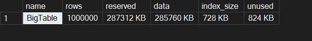
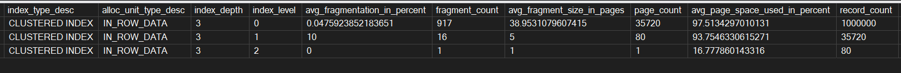
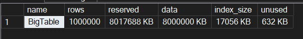
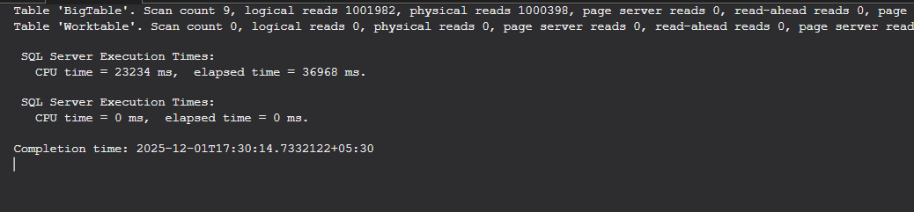
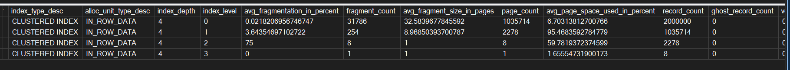
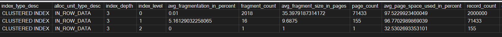

Today, We'll just noodle through and blow up the fill factor param of the index and see how SQL server reacts to it.

### What is Fill factor anyway ?
- Fill factor is a setting that determines, how **full an index page will be**, when it gets **created or rebuilt**. It is like an **initial packing strategy** (Say, how much chips can I pack into the cover, when I am filling the cover kind of thing...)
- SQL server stores data in **8KB pages**, So what happens in these pages is that, SQL server **fills each page upto the percentage that is specified in the Fill factor param**, leaving the **rest of the space for future growth**.
  
**Example:**
- FILLFACTOR = 100 → Pages are packed as full as possible.
- FILLFACTOR = 80 → Pages are filled to 80%, leaving 20% free space (so that future inserts can come in...)

### Why should you care ?
#### Page splits:
 - When you insert a row into a page that’s already full, SQL Server **must split the page into two**, move half the rows, and update pointers. **This is expensive: extra I/O, CPU, and fragmentation.**
 - When **FF is low**: Leaves room for inserts and updates, reducing page splits. But: increases index size → more pages → more reads → more memory usage.
 - When **FF is high**: Compact index → faster reads, smaller footprint. But: more page splits if inserts happen in the middle of the index.
 - Default FF is 0 (which also means 100 → the pages will gets filled to maximum capacity).
 - It is very important to get a balance in FF depending on the workload that is in consideration.

### What are we upto today ?
- We're going to set the fill factor on a 100K row clustered index (I tested with 1M rows, trust me, I don't want to smoke your system.) and we're going to see how the disk space and the pages and correspondingly, the logical reads for a SELECT are going to blow.

Let's setup the environment for the experiment :

```sql
USE master;
GO

--Create a dedicated database for the experiment
IF DB_ID('FillFactorMadLab') IS NULL
    CREATE DATABASE FillFactorMadLab;
GO
USE FillFactorMadLab;
GO

-- Create the large table
IF OBJECT_ID('dbo.BigTable') IS NOT NULL DROP TABLE dbo.BigTable;
GO

CREATE TABLE dbo.BigTable
(
    ID BIGINT IDENTITY(1,1) NOT NULL,
    CustomerName CHAR(50) NOT NULL DEFAULT REPLICATE('X',50),
    OrderDate DATETIME2(0) NOT NULL DEFAULT GETDATE(),
    Amount DECIMAL(12,2) NOT NULL DEFAULT 100.00,
    Notes CHAR(200) NULL
);
GO

-- Create clustered index on ID
CREATE CLUSTERED INDEX CX_BigTable ON dbo.BigTable(ID);
GO
```

Let's populate the table with 1 Million rows.

```sql
PRINT 'Inserting initial data...';
GO

SET NOCOUNT ON;
DECLARE @Rows INT = 1000000; -- 1 million rows
;WITH N AS (
    SELECT TOP(@Rows) ROW_NUMBER() OVER (ORDER BY (SELECT NULL)) AS rn
    FROM sys.all_objects a CROSS JOIN sys.all_objects b
)
INSERT INTO dbo.BigTable (CustomerName, OrderDate, Amount, Notes)
SELECT REPLICATE('A',50),
       DATEADD(SECOND, rn, '2025-01-01'),
       ROUND(1000*RAND(CHECKSUM(NEWID())),2),
       REPLICATE('Z',200)
FROM N;
GO
```
Post populating the table, I am just rebuilding the CI, to get a perfect baseline stat.

```sql
ALTER INDEX ALL ON dbo.BigTable REBUILD WITH (FILLFACTOR = 100, SORT_IN_TEMPDB = ON, ONLINE = OFF);
GO
```

Then, Let's get the stats...

```sql
PRINT 'Baseline measurements (FILLFACTOR = default 100)...';
GO

-- Table size
EXEC sp_spaceused 'dbo.BigTable';
GO

-- Index physical stats
SELECT OBJECT_NAME(object_id) AS TableName,*
FROM sys.dm_db_index_physical_stats(DB_ID('FillFactorMadLab'), OBJECT_ID('dbo.BigTable'), NULL, NULL, 'DETAILED');
GO
```

We're going to take a lot of observation from these baseline metrics.



#### What do the numbers mean ?
- **rows**: 1,000,000 → Total rows in the table.
- **reserved**: 287,312 KB (~280 MB) → Total space reserved for this table (data + index + unused).
- **data**: 285,760 KB (~279 MB) → Space used by actual table rows (leaf level of the clustered index).
- **index_size**: 728 KB (~0.7 MB) → Space used by non-leaf levels of the clustered index (root + intermediate pages).
- **unused**: 824 KB (~0.8 MB) → Reserved but not currently used.



This is the output from the **sys.dm_db_index_physical_stats** function, this gives us a lot of depth as to how things are, underneath the hood.


This is how an index looks under the hood (Image taken from [here](https://use-the-index-luke.com/sql/anatomy/the-tree)). Now, the output may make a bit sense to you.

#### What do the numbers mean ?


##### **Index Depth**
- **index_depth = 3**  - total number of levels in the B-tree (this column shows 3 in all the rows of the output)
  The entire B-tree has **3 levels**:
  - **Level 0** → Leaf (data pages)
  - **Level 1** → Intermediate
  - **Level 2** → Root


##### **Index Levels** 
- **index_level** (This column tells more about individual level number and its content)
  - **0** → Leaf level (actual data pages)
  - **1** → Intermediate level
  - **2** → Root level


##### **Average Fragmentation**
- **Leaf level**: `0.047%` → Almost no fragmentation (great after rebuild).
- **Intermediate level**: `10%` → Some logical fragmentation in non-leaf pages.
- **Root level**: `0%` → Perfectly ordered.


##### **Fragment Count**
- **Leaf**: `917 fragments` → Groups of contiguous pages.
- **Intermediate**: `16 fragments`.
- **Root**: `1 fragment`.


##### **Average Fragment Size (in pages)**
- **Leaf**: ~`39 pages per fragment`.
- **Intermediate**: `5 pages per fragment`.
- **Root**: `1 page` (obviously).


##### **Page Count**
- **Leaf**: `35,720 pages` → This is where most space is consumed.
- **Intermediate**: `80 pages`.
- **Root**: `1 page`.


##### **Average Page Space Used**
- **Leaf**: `97.5%` → Pages are almost full (because FF=100 after rebuild).
- **Intermediate**: `93.7%`.
- **Root**: `16.7%` (root often has lots of empty space because it only stores pointers).


##### **Record Count**
- **Leaf**: `1,000,000 rows` → All your data.
- **Intermediate**: `35,720 pointers`.
- **Root**: `80 pointers`.


Yeah, I know you read every single line from the output that I provided 🌚. But seriously, Consider taking a minute or two to read these lines and what they mean....(Just to appreciate my efforts to format them 🥺)

For now, We have the baseline metric. We will proceed to blow up the index and recreate it using fill factor = 1 and see how things move from there...

```sql
PRINT 'Rebuilding clustered index with FILLFACTOR = 1 (Apocalypse)...';
GO

ALTER INDEX ALL ON dbo.BigTable REBUILD WITH (FILLFACTOR = 1, SORT_IN_TEMPDB = ON, ONLINE = OFF);
GO
```



The size of the table has blown to a whopping 8GB from 280MB, for the same 1 Million rows...
Also, the index structure has also significantly increased.


#### Observations:
- The Tree depth now has 4 levels, from initial 3 levels.
- There are 1,000,000 leaf pages for 1 Million rows - (1 row per page).
- The average space used is just around 3% now.
  
This satisfies the math right, 8KB into 1 Million pages is around 8GB...

Let's see how this affects performance during reads...

```sql
PRINT 'Query performance test after FF=1...';
GO

DBCC DROPCLEANBUFFERS()

SET STATISTICS IO ON;
SET STATISTICS TIME ON;

SELECT COUNT(*) FROM dbo.BigTable;

SET STATISTICS IO OFF;
SET STATISTICS TIME OFF;
GO
```


Well.. Well, what do we have here ?

We have read more than 1 Million pages from Disk (I have switched off read ahead reads purposefully) which is very very very costly... And, it has taken more than 36 seconds.

**So, this explains... If we have a very packed page,containing 100% data, then We can store stuff within less pages and We can fetch more content by fetching less pages.** But, it still depends on the workload type and stuff...

Let's try inserting a 100k more rows and see what happens to the index.

Okay, By mistake, I guess I ended up inserting 1 Million rows instead of 100k rows (Another lesson, read your script before running 😆)



Since we have a lottt of empty space in those 1 Million leaf pages, these rows have been easily accomodated and page level space consumption has just gone from 3% to 6%.

Okayy then, Let's just set things back to normal and rebuild the index back with 100% Fill factor and see how the index structure looks.


Niceeeee... We have gone down from 8GB back to just more than 500MB.



Sweeet... The index has been entirely rebuilt and now has just 3 levels and only 70,000 leaf pages from 1,000,000 leaf pages.

I wont run the select now, cause, obviously, since the page count has reduced, the time and IO will reduce significantly, but please do try it on your own once and see the results...

Well that's it for this one...

Until Next time, Happy Noodling 😄!


