---
title: What if DBCC CHECKDB lied to you ? 
date: 2025-12-04
categories: [Internals, DBCC]
tags: [dbcc checkdb, pages]     # TAG names should always be lowercase
description: Exploring Logical Corruption Beyond Physical Checks, Playing with page to page links 🤩
--- 

I was reading through what DBCC CHECKDB does and found one point very cool, a very key difference between running it normally and running it with the **WITH PHYSICAL_ONLY**. We're going to dive into that aspect today, get very deep into page level, break chains and those kinda stuff 🤩


### What does CHECKDB do?
-  I would really suggest you to read the [official documentation for CHECKDB](https://learn.microsoft.com/en-us/sql/t-sql/database-console-commands/dbcc-checkdb-transact-sql?view=sql-server-ver17)(yeah, read it 😅).
-  TL;DR, It is a database doctor kind of command, It starts by checking physical consistency like page headers and checksums, then moves on to logical consistency such as index linkage and allocation maps, and finally relational consistency like constraints and relationships.
-  When you run DBCC CHECKDB with PHYSICAL_ONLY, it’s basically a lightweight version of the full check. Instead of diving into every logical and relational detail, it focuses only on the physical health of your database. It checks page headers, verifies checksums, and looks for torn pages or I/O-level corruption. 
- It skips all the deep logical checks like index linkage, row offsets, and foreign key relationships. So if your index chain is broken, PHYSICAL_ONLY will happily report “all good” because the pages look fine physically. That’s why it’s fast and great for frequent health checks, but it’s not a substitute for a full CHECKDB when you want to guarantee logical consistency.

### What are we upto today ?
We're going to take index pages and break chains between them and see how it affects your SELECT statements and how **DBCC CHECKDB** and **DBCC CHECKDB WITH PHYSICAL_ONLY** react to both.

Let's setup the environment:

```sql

USE master;
IF DB_ID('LinkageLab') IS NOT NULL DROP DATABASE LinkageLab;
CREATE DATABASE LinkageLab;
GO
USE LinkageLab;
GO

-- Make rows wide to guarantee multiple index pages
CREATE TABLE dbo.Table1
(
    ID   INT NOT NULL,
    Pad  CHAR(800) NOT NULL DEFAULT REPLICATE('X',800),

);
GO

-- Create Nonclustered index (gives you more PageType=2 choices)
CREATE NONCLUSTERED INDEX IX_T_ID ON dbo.Table1(ID);
GO
```

INSERT some rows and get the baseline as to how things look.

```sql
WITH nums AS (
    SELECT TOP (5000) ROW_NUMBER() OVER (ORDER BY (SELECT 1)) AS n
    FROM sys.all_objects
)
INSERT dbo.Table1 (ID) SELECT n FROM nums;
GO
```

```sql
SET STATISTICS IO ON
SET STATISTICS TIME ON

select count(id) as initial_count from Table1

SET STATISTICS IO OFF
SET STATISTICS TIME OFF

```

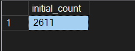

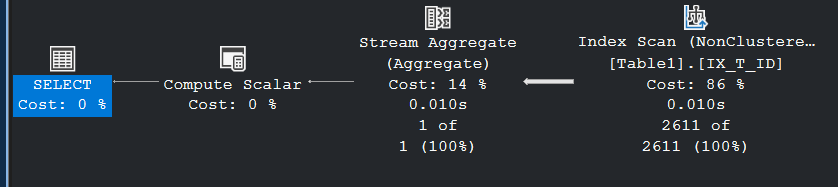

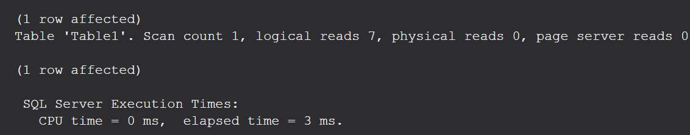

### Now, for the fun part.

Let's get the page details, what are the pages present and stuff...

We're going to use **DBCC IND**. DBCC IND is an undocumented SQL Server command that lists all the pages associated with a specific table or index in a database. Also shows details like PageID, FileID, page type, index level, and linkage pointers. 

```sql
DBCC IND ('LinkageLab', 'dbo.Table1',2);
GO
```


This is how an index looks under the hood (Image taken from [here](https://use-the-index-luke.com/sql/anatomy/the-tree)). 

Can you see the back and forth connections between the leaf nodes themselves ? Those are the pointers to next and previous pages. Here in the table, they are the columns **NextPageID and PrevPageID.**

Next, let's pick a page(page 817) and see what's inside that... How? using DBCC PAGE...

DBCC PAGE is another undocumented diagnostic command in SQL Server that lets you inspect the contents of a specific data page at a very low level.

```sql
DBCC PAGE ('LinkageLab', 1, 635, 2);
GO
```
This is the output of DBCC page, it shows both the metadata and raw byte contents. 
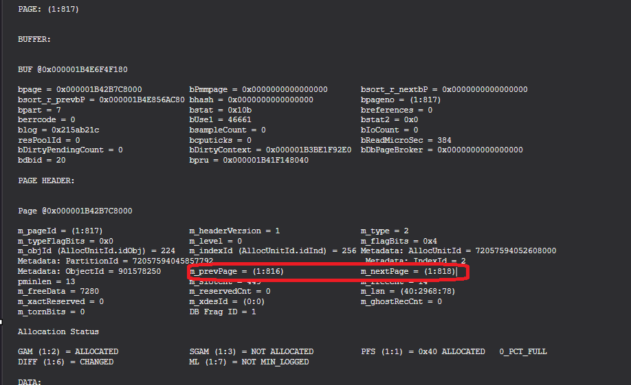

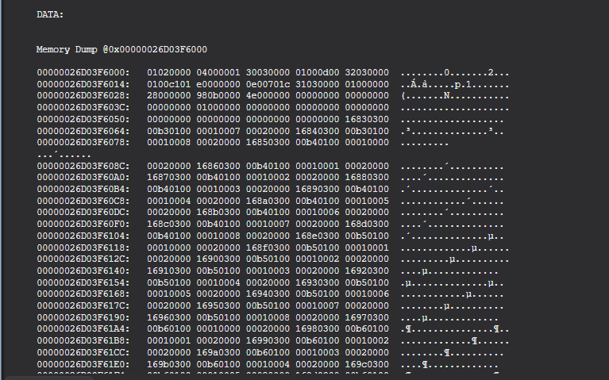

SO, what we ideally are going to do is that, we're going to tamper the value of the next pointer, such that, we break the link between this page and the next page and SQL server can't navigate to next pages from this page to fetch data...

How are we going to do that ?


Turns out that, the first 96 bytes are the page header, and in that... the **32030000** converted to hex represents 818 (that is our next page) meaning, the m_nextpage field's value. I'd highly suggest using some Gen AI tool if you want to decipher your page header contents, cause it may differ from system to system.

```sql
-- LAB ONLY — do NOT run on any production database, if you don't want to get fired.
DBCC TRACEON (3604);
DECLARE @offset  INT = 16;  -- start of m_nextPage
DECLARE @length  INT = 6;   -- 4 bytes pageID + 2 bytes fileID

-- Write via buffer pool so page checksum is recomputed when flushed.
DBCC WRITEPAGE ('LinkageLab', 1, 817, @offset, @length, 0x000000000000, 0);
```
DBCC WRITEPAGE is an undocumented command that lets a sysadmin edit arbitrary bytes on any data page in any database. It exists for the SQL Server team’s internal testing (e.g., engineering controlled corruptions to validate repair logic) and for niche disaster‑recovery scenarios. Microsoft does not support its use

This command overwrites @length (16) bytes starting at @offset(6) on page (1:817) with zeros, and does so via the buffer pool (not direct I/O). Because we used the buffer‑pool path (0), SQL Server will recalculate the page checksum, so PHYSICAL_ONLY integrity checks won’t report checksum errors—even though we may have introduced a logical inconsistency (e.g., breaking the m_nextPage pointer in the page header).

After we've run this...

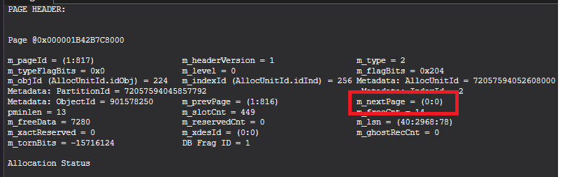

Let's run both the variants of CHECKDB

```sql
DBCC CHECKDB ('LinkageLab') WITH PHYSICAL_ONLY;
```

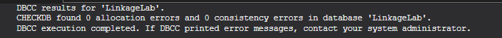

```sql
DBCC CHECKDB ('LinkageLab') 
```

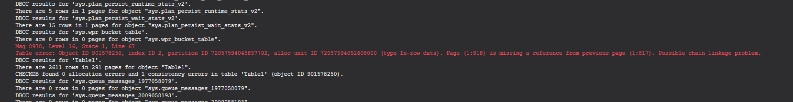

> Table error: Object ID 901578250, index ID 2, partition ID 72057594045857792, alloc unit ID 72057594052608000 (type In-row data). Page (1:818) is missing a reference from previous page (1:817). Possible chain linkage problem.

Sweet ! We have broken the chain ! Now let's run the SELECT statement and see...

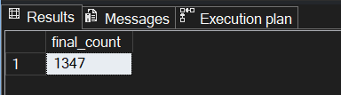
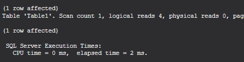
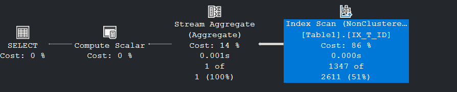

**OBSERVATIONS:**
- The SELECT works fine, but we've lost half the number of rows!
- At the baseline, we read 7 pages. Now, we lost 3 pages after 817 due to the miss.
- As far as the plan is concerned, am not exactly sure why it shows what it shows...


### How to fix this ?
- We can manually rewrite the bytes that we changed (😅)
- Or, we can just do **DBCC CHECKDB('LinkageLab',REPAIR_REBUILD)** or other DBCC options.

```sql
ALTER DATABASE LinkageLab SET SINGLE_USER WITH ROLLBACK IMMEDIATE;
DBCC CHECKDB('LinkageLab',REPAIR_REBUILD)  ;

ALTER DATABASE LinkageLab SET MULTI_USER WITH ROLLBACK IMMEDIATE;
```

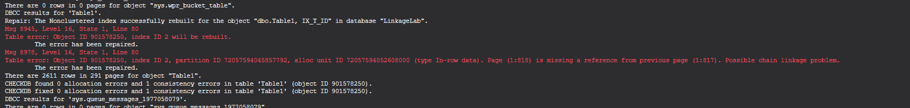

Post fixing, SELECT will work as expected !

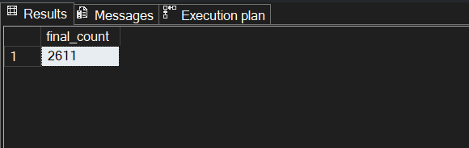


So here’s the bottom line: DBCC CHECKDB is way more than a checksum check—it digs into physical, logical, and relational consistency. PHYSICAL_ONLY is quick but blind to logical issues, which is why our broken index chain slipped through without errors. Writing through the buffer pool kept the checksum valid, proving that silent corruption is real. Manual byte edits? Fun for learning, but not a real fix—REBUILD or CHECKDB repair is the right way...

Well that's it for this one...

Until Next time, Happy Noodling 😄!
