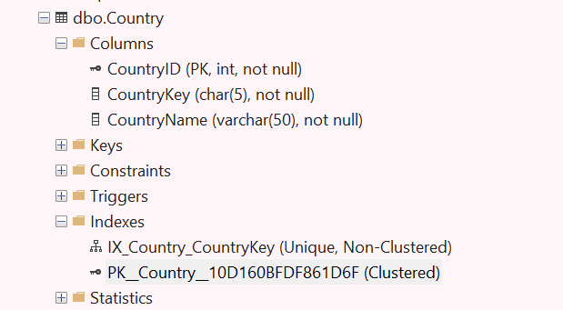
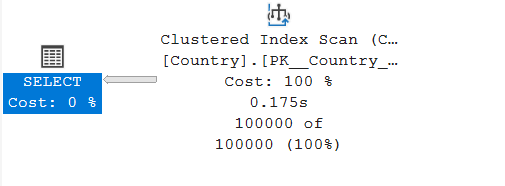
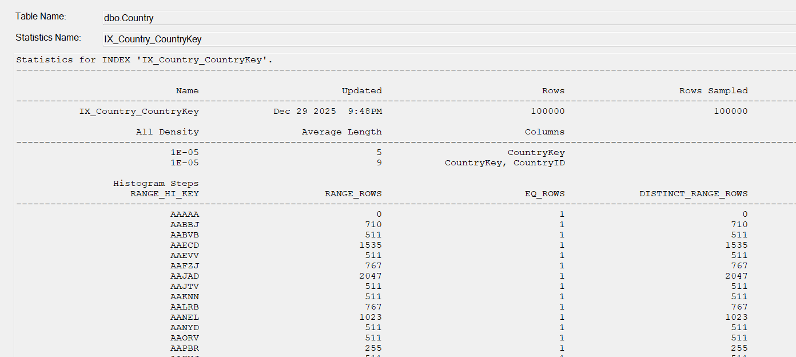
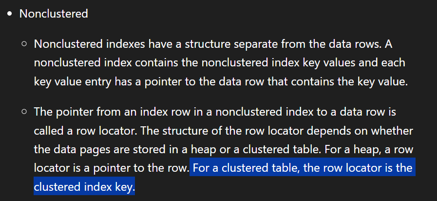
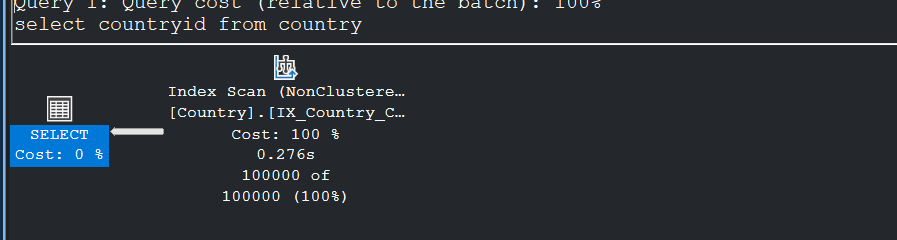
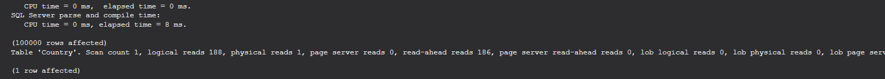
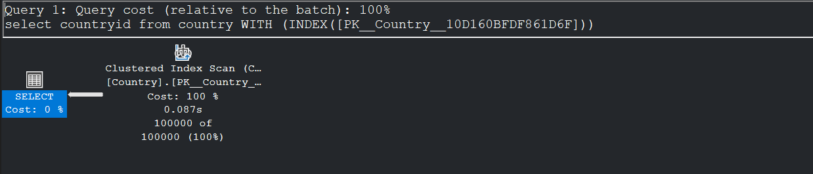
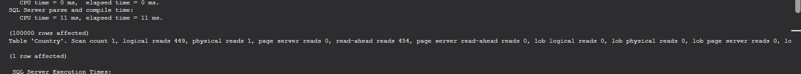
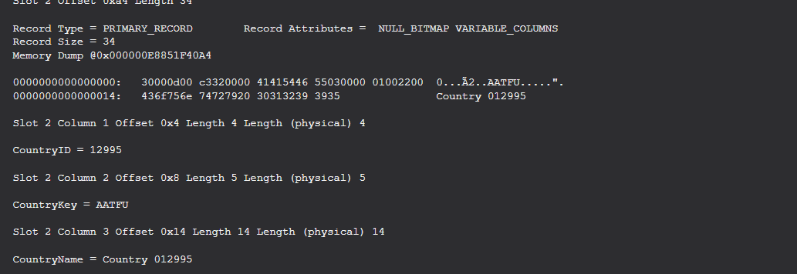
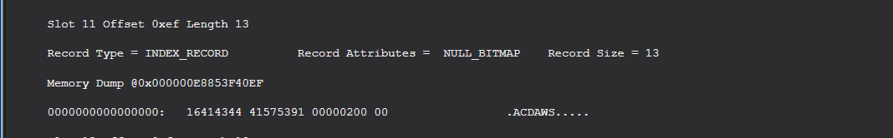

Okay... Let's play a game... I will show you a table, you predict the execution plan...

```sql

CREATE TABLE [dbo].[Country](
	[CountryID] [int] IDENTITY(1,1) NOT NULL,
	[CountryKey] [char](5) NOT NULL,
	[CountryName] [varchar](50) NOT NULL,
PRIMARY KEY CLUSTERED 
(
	[CountryID] ASC
)WITH (PAD_INDEX = OFF, STATISTICS_NORECOMPUTE = OFF, IGNORE_DUP_KEY = OFF, ALLOW_ROW_LOCKS = ON, ALLOW_PAGE_LOCKS = ON, OPTIMIZE_FOR_SEQUENTIAL_KEY = OFF) ON [PRIMARY]
) ON [PRIMARY]
GO

```

There are two Indexes...

```sql
--CLUSTERED INDEX ON [CountryID]
ALTER TABLE [dbo].[Country] ADD PRIMARY KEY CLUSTERED 
(
	[CountryID] ASC
)WITH (PAD_INDEX = OFF, STATISTICS_NORECOMPUTE = OFF, SORT_IN_TEMPDB = OFF, IGNORE_DUP_KEY = OFF, ONLINE = OFF, ALLOW_ROW_LOCKS = ON, ALLOW_PAGE_LOCKS = ON, OPTIMIZE_FOR_SEQUENTIAL_KEY = OFF) ON [PRIMARY]
GO

--NON CLUSTERED INDEX ON [CountryKey]
CREATE UNIQUE NONCLUSTERED INDEX [IX_Country_CountryKey] ON [dbo].[Country]
(
	[CountryKey] ASC
)WITH (PAD_INDEX = OFF, STATISTICS_NORECOMPUTE = OFF, SORT_IN_TEMPDB = OFF, IGNORE_DUP_KEY = OFF, DROP_EXISTING = OFF, ONLINE = OFF, ALLOW_ROW_LOCKS = ON, ALLOW_PAGE_LOCKS = ON, OPTIMIZE_FOR_SEQUENTIAL_KEY = OFF) ON [PRIMARY]
GO

```

Okay, I know that was too much text... A pic might be helpful...




We have the **clustered index on the ID (integer) column** and the **Non clustered index on the CountryKey (char(5)) column**.

Okay... I will tell the query now... guess the execution plan...

```sql
select countryid from country
```

{:width="300px" height="200px"}

Yeah, I get it... This may be stupid... But just do a rough guess...

Okay...

```sql
select countryid from country
```

If you had something like below in mind...



High Five !... Even I had something similiar and whomever I showed this had something similiar in mind... But what actually happened is...


Yeah... I get it... How would that happen ? The CountryID column itself is not there in the index, then how 😲?... 

Well... Let's dive into this thing...

For this one, what I did first was, I know it does'nt make sense, but still I just went and checked the stats for this Nonclustered Index.




What is the CountryID row doing here ?... 

To answer that question, we need to go to the definition of a Nonclustered Index... Let's head to the Microsoft docs...



So, that deals half the doubt right... Since the NCI itself contains the clustered index key, Since we are not putting any filters (WHERE) clause, we are however going to scan the whole Datastructure irrespective of whether it is the CI or the NCI.

But still, it how does it differ cost wise...?

We'll benchmark that one as well... First, let's see how much pages the NCI is going to fetch and then how much pages the CI is going to fetch and why that happens...

```sql
select countryid from country
```




>(100000 rows affected)
Table 'Country'. **Scan count 1, logical reads 188, physical reads 1, page server reads 0, read-ahead reads 186**, page server read-ahead reads 0, lob logical reads 0, lob physical reads 0, lob page server reads 0, lob read-ahead reads 0, lob page server read-ahead reads 0.

We're touching 188 pages for data, when this uses the NCI...

Let's force it to use the CI...

```sql
select countryid from country WITH (INDEX([PK__Country__10D160BFDF861D6F]))
```




>(100000 rows affected)
Table 'Country'. **Scan count 1, logical reads 449, physical reads 1, page server reads 0, read-ahead reads 454**, page server read-ahead reads 0, lob logical reads 0, lob physical reads 0, lob page server reads 0, lob read-ahead reads 0, lob page server read-ahead reads 0.

**We're touching more than 450 pages for the CI usage... Which is 3 times more logical reads!**

Why is that so ?... We'll see that as well...For that, as usual we may need to go into page level...

We'll check one random page for the clustered index and one page for the non clustered Index...

```sql

DBCC IND('dummy','country',-1) -- to get the pageIDs for the CI and NCI present in the table

DBCC TRACEON(3604)
DBCC PAGE('dummy',1,41781,3) --to inspect into the contents of a particular page.
```

**For Clustered Index:**



**For Non Clustered Index:**



okay, on the outset, things may look blurry... but if we look at the data row level... it may make a bit more sense...

### Let's do the math:
- Size of a single page - 8KB - 8192 bytes.
- Consider Clustered Index and what it stores...
   - int 4 bytes (CountryID) + Char(5) 5 bytes (CountryKey) + varchar(50)- but here it is 14 bytes(that's how the data looks here...) = around 23 bytes per row
   - 8192/23 = > 356 rows can be fit in one page.
   - 100,000/356 => 280 pages (just raw data) for the clustered index.
- Consider the NonClustered Index now:
   - int 4 bytes (CountryID) + Char(5) 5 bytes (CountryKey) = around 9 bytes per row.
   - 8192/9 => 910 rows can be fit into one page.
   -  100,000/910 => 110 pages (just raw data) for the non clustered index.
- This is just a very very raw, back of napkin rough calculation for the breakup of contents inside a page. There are other fields like Keyhashvalue and other stuff which will contribute to the size of the rows and there are other metadata, page headers and multiple levels of pages needed to lay the structure of the tree.
- This calculation just gave an approx ratio of cost between NCI and CI, which is 1:3, which also got reflected in our actual experiment.


### TL;DR:
- The main outcome that we should get out of this experiment is that, we should let SQL optimizer do its math and let it figure out which datastructure or which operator would be the best to carryout the execution of a particular query.
- As long as we know what we are doing, it is not that ideal to tell SQL server how to do things( forcing indexes\Join methods\hinting stuff), rather we should be telling what we want from it, very precisely without bloating the engine, So that, SQL server can do it's own thing and bring out stuff in a very optimal way.

Well that's it for this one...

Until Next time, Happy Noodling 😄!

